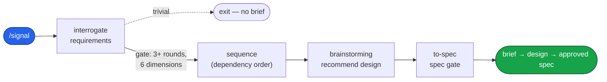

# Engineering

A Claude Code plugin: a complete software-development pipeline that carries a request
from a vague ask — or a reported defect — all the way to a green, documented branch.
File-based from end to end: every artifact the pipeline produces is a file on disk.
The pipeline ends at a green, documented branch — deployment, release, and rollback
are deliberately out of scope.

This repository is the `dashworthy` Claude Code marketplace. Its primary plugin,
`engineering`, carries the whole pipeline; a small companion plugin, `laravel`, ships
Laravel pre-commit hooks (Pint, PHPStan, Pest) and is installed separately.

## Install

```
/plugin marketplace add https://github.com/dashworthy/engineering
/plugin install engineering@dashworthy
```

One install: `engineering` carries the whole pipeline.

## What it does

Work enters through one of two doors and leaves through one. A feature or a vague
request enters at **discover** (`/signal`); a reported defect enters at **triage**
(`/triage`). Both doors open onto the same **design dialogue** (`brainstorming`), which
recommends a design, then hands off to **`to-spec`**, the single writer that turns that
design into one spec document and holds the pipeline's first approval gate — on the spec.
From that spec, a fixed backbone runs the work to done: **plan** it, behind the second
gate; **build** it test-first; **harden** the tests; and **document** the prose the
branch touched.

```mermaid
flowchart TD
    classDef entry fill:#2563eb,stroke:#1e3a8a,color:#fff
    classDef done fill:#16a34a,stroke:#14532d,color:#fff

    F(["feature / vague ask"]):::entry --> SIG["signal<br/>discovery"]
    D(["reported defect"]):::entry --> TRI["triage"]

    SIG --> DES["brainstorming<br/>design dialogue"]
    TRI -->|"needs a decision"| DES
    TRI -. "quick fix" .-> FIX["diagnosing-bugs"]

    DES --> SPEC["to-spec"]
    SPEC --> BB["plan · build · harden · document"]
    BB --> DONE(["green, documented branch"]):::done
    FIX -. .-> DONE
```

Each phase reads what the phase before it produced; none re-decides what an earlier
phase already settled. The sections below walk each phase in turn.

## The pipeline, phase by phase

### 1. Discover — `signal`

A vague ask becomes a brief, then a recommended design, then an approved spec.
Interrogation probes the request one question at a time, offering a conventional baseline
and mining the correction, until every coverage dimension is filled. A scope-expansion
beat then surfaces adjacent value. Sequencing orders the work by dependency; the finished
brief then passes to `brainstorming` — signal's terminal hand-off — which recommends a
design and hands it to `to-spec`, where the spec gate takes the human's approval. A
genuinely trivial request exits before any brief is written.



### 2. Triage — `triage`

A reported defect is verified to reproduce, isolated to a domain concept, then routed
to the smallest next step. A quick fix goes straight to `diagnosing-bugs`; a vague
report loops back through `signal` to gather requirements; a change that warrants a
spec goes on to the design dialogue.


### 3. Design dialogue — `brainstorming`

Both entrances meet here. The design phase explores the context, proposes two or three
approaches with their trade-offs, and recommends one with its reasoning. It holds no
approval gate of its own: brainstorming hands the recommended design to `to-spec`, where
the spec gate takes the human's approval — the pipeline's first human-approval gate.


### 4. Build backbone — `plan → build → harden → document`

Every spec leaves the same way. `writing-plans` turns it into an ordered, bite-sized
plan; `/implement` drives each task through a test-first `tdd` loop gated by
`code-review`; `conducting-test-hardening` closes the gaps a first pass leaves behind;
and docs hardening rewrites the prose the branch touched into plain language.


## Skill suite

The plugin ships **38 skills**, grouped by the phase they serve. Process-tied skills
carry their group as a `[Tag]` in the skill's description; cross-cutting skills carry
none.

| Group | Skills |
|---|---|
| Discovery | `conducting-discovery`, `interrogating-requirements`, `expanding-scope`, `sequencing-requirements`, `to-spec`, `domain-modeling`, `identifying-code-conventions`, `recording-code-conventions` |
| Triage | `triage` |
| Design | `brainstorming`, `codebase-design`, `improve-codebase-architecture`, `prototype` |
| Planning | `writing-plans`, `executing-plans` |
| Build | `tdd`, `diagnosing-bugs`, `code-review`, `requesting-code-review`, `receiving-code-review`, `using-code-conventions` |
| Test hardening | `conducting-test-hardening`, `auditing-test-gaps`, `verifying-test-integrity`, `writing-tests-from-brief` |
| Docs | `clarifying-docblocks`, `rewriting-docblock-prose`, `verifying-docblock-claims` |
| Foundation | `using-git-worktrees`, `using-stacked-pull-requests`, `finishing-a-development-branch`, `verification-before-completion`, `dispatching-parallel-agents`, `writing-skills`, `using-skills` |
| Cross-cutting | `research`, `resolving-merge-conflicts`, `using-diagrams` |

The full index lives at
[engineering/skills/README.md](engineering/skills/README.md).

### Commands

Eight slash commands sit on top of the suite: `/signal`, `/triage`, `/vernacular`,
`/improve-codebase-architecture`, `/implement`, `/handoff`, `/to-signal`, and
`/wait-what`.

## License

MIT. See [LICENSE](LICENSE).
