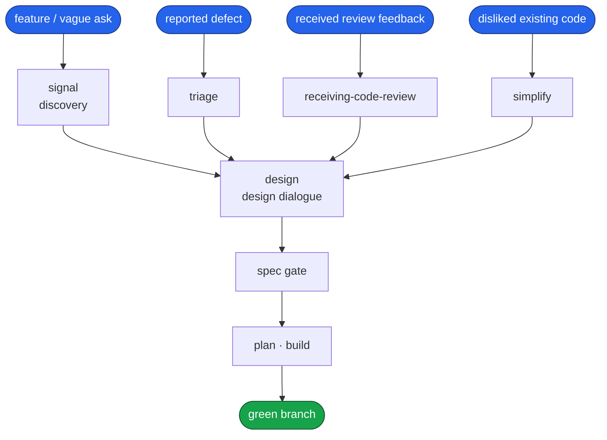
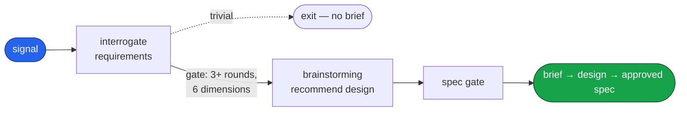
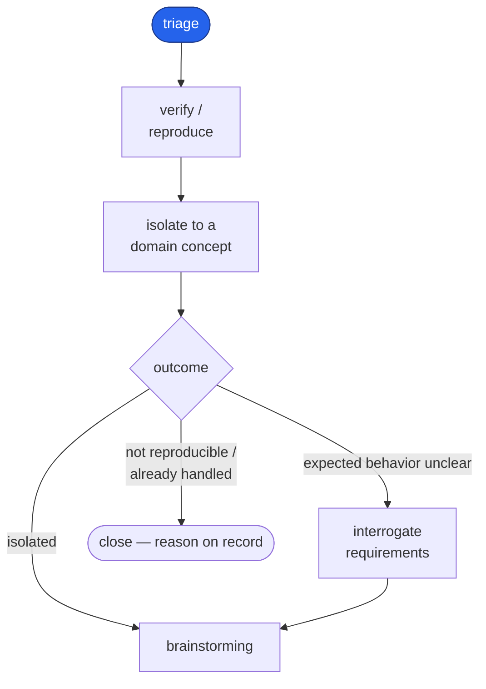
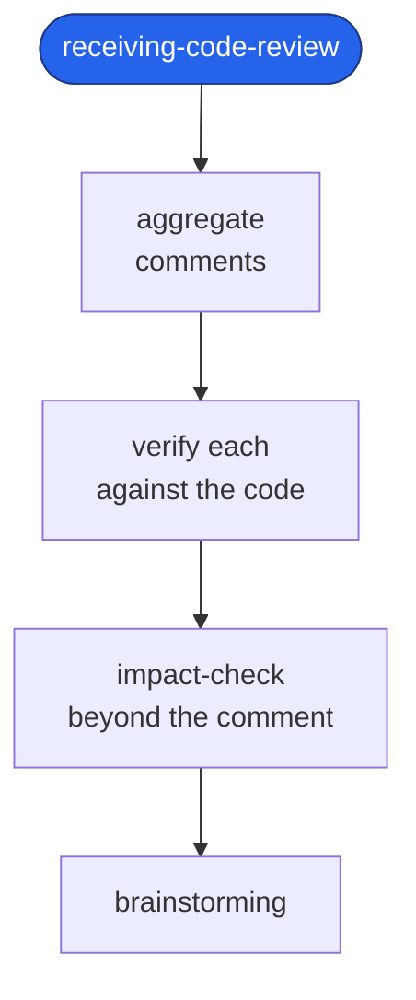
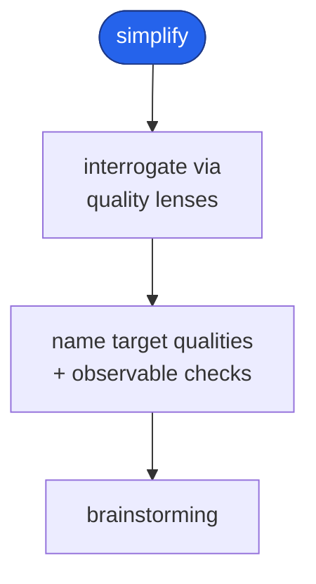
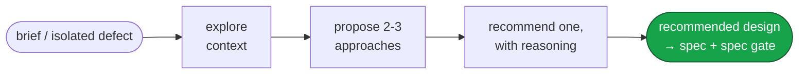
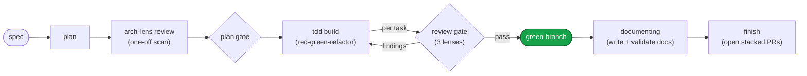

# Engineering

A Claude Code plugin: a complete software-development pipeline that carries a request
from a vague ask — or a reported defect — all the way to a green, documented branch.
File-based from end to end: every artifact the pipeline produces is a file on disk.
The pipeline ends at a green, documented branch — deployment, release, and rollback
are deliberately out of scope.

This repository is the `engineering` Claude Code marketplace: a single plugin, `engineering`,
that carries the whole pipeline. An in-depth, opt-in code-review gate ships inside
`engineering` itself, as the `code-review` skill.

## Install

```
/plugin marketplace add https://github.com/dashworthy/engineering
/plugin install engineering@engineering
```

One install: `engineering` carries the whole pipeline.

## What it does

Work enters through one of four doors and leaves through one. A feature or a vague
request enters at **discover** (`engineering:signal`); a reported defect enters at **triage**
(`engineering:triage`); received review feedback enters at **receiving code review**
(`engineering:receiving-code-review`); existing code you dislike and want reshaped enters at
**simplify** (`engineering:simplify`). Each door is a skill. All four open onto the same **design dialogue**
(`brainstorming`), which recommends a design; the **spec** phase then writes that design into one spec
document and holds the pipeline's first approval gate — on the spec.
From that spec, a fixed backbone runs the work to done: **plan** it, behind the second
gate, then **build** it test-first — the build's per-task review applying three lenses:
standards (good code), spec (does what was asked), and an ELI5 lens that flags docblocks
needing plainer prose.



Each phase reads what the phase before it produced; none re-decides what an earlier
phase already settled. The sections below walk each phase in turn.

## The pipeline, phase by phase

### 1. Discover — `signal`

A vague ask becomes a brief, then a recommended design, then an approved spec.
Interrogation probes the request one question at a time, offering a conventional baseline
and mining the correction, until every coverage dimension is filled and `brief.md` §1–§6
is written. The finished brief then passes to `brainstorming` — signal's terminal hand-off
— which recommends a design; the `spec` phase then writes the spec, where the spec gate takes the
human's approval. A genuinely trivial request exits before any brief is written.



### 2. Triage — `triage`

A reported defect is verified to reproduce and isolated to a domain concept, then handed
to the design dialogue — the same convergence every entrance makes. A report whose expected
behavior is unclear is interrogated for requirements first; one that turns out not to
reproduce, already fixed, or already rejected is closed with the reason on record.



### 3. Receiving code review — `receiving-code-review`

Review feedback is aggregated, verified against the codebase, and impact-checked — does the
issue reach beyond the line the reviewer pointed at — before any of it is implemented. Each
ask gets a reply on its own thread and a fix stacked onto the original review branch, and
whether to resolve a thread is the user's call once the fix is shown. The shaped feedback
then meets the same design dialogue.



### 4. Simplify — `simplify`

Existing code a developer dislikes is interrogated into a brief, then handed to the design
dialogue — the same convergence every entrance makes. Rather than guess what "nicer" means, the
interrogation drives a fixed set of **language-neutral quality lenses** (nesting, duplication,
naming, dead code, over-abstraction, over-cleverness, single-responsibility, cohesion), turning
each expressed dislike into a **named target quality paired with an observable check** and refusing
to hand off while "better" is still an unmeasured preference. The entrance proposes no refactors and
changes no code — the shaped brief meets `brainstorming`, where the refactor approaches are proposed
for the developer to accept or reject. It is distinct from the base `simplify` skill, which reviews
the current diff and applies cleanups.



### 5. Design — `brainstorming` → `spec`

All four entrances meet at `brainstorming`. It explores the context, proposes two or three
approaches with their trade-offs, recommends one with its reasoning, and shapes any load-bearing
boundary the approach turns on via `using-codebase-design`. It holds no approval gate of its own: it hands
the recommended design to the `spec` phase, which writes the spec and holds the spec gate — the
pipeline's first human-approval gate.



### 6. Build backbone — `plan → build → documenting → finish`

Every spec leaves the same way. `plan` turns it into an ordered, bite-sized
plan — each task carrying a code sketch of the change it makes — then `plan`'s own arch-lens review runs
the architecture lens over those sketches and flags any one-off data structure before the
plan reaches the second human gate; `engineering:build` drives each task through a test-first `tdd`
loop gated by an internal per-task review. That review applies three lenses in parallel —
standards (good code on its own terms), spec (does what was asked), and an ELI5 docblock lens
that surfaces prose a reader outside the team couldn't follow — and its findings are fixed in the
task's own diff. Once the branch is green, `documenting` runs on it: it judges whether the run
changed documented behavior and, when it did, writes or surgically updates the feature's docs under
`docs/` from what actually shipped and validates them through a four-lens fan-out, before `finish`
integrates the branch.



## Skill suite

The plugin ships **21 skills**: a bootstrap, four entrances, six phase conductors, nine
cross-cutting skills, and an opt-in deep-review orchestrator. Everything else a phase needs lives
as reference files the conductor loads, not as a separately discoverable skill.

| Group | Skills |
|---|---|
| Bootstrap | `using-skills` |
| Entrances | `signal`, `triage`, `receiving-code-review`, `simplify` |
| Phase conductors | `brainstorming`, `spec`, `plan`, `build`, `documenting`, `finish` |
| Cross-cutting | `using-codebase-design`, `using-stacked-pull-requests`, `using-diagrams`, `using-questions`, `using-verification`, `using-parallel-agents`, `using-documentation`, `using-requirements-gathering`, `refusing-deferral` |
| Deep review | `code-review` |

Each phase conductor drives its substages from reference files under its own `references/`
directory — `build` loads the TDD loop and the review protocol, and so on — and hands work to
subagents where a context firewall or parallelism earns it. Folding most substages out of the skill
list is what keeps the suite compact; a piece stays a skill when more than one conductor invokes it
by name — `using-codebase-design` (the shape lenses), for instance, is invoked by `brainstorming` to shape
a boundary and by `plan`'s arch-lens review to judge one.

Skills live flat in `skills/` — the plugin loader scans one level deep — and a directory earns
its own `SKILL.md` only when it must be discovered on its own, where no conductor is already
driving it. Everything else a conductor needs is a **reference file** it loads:

| Owner | References |
|---|---|
| `spec` | `references/SPEC-FORMAT.md` |
| `using-codebase-design` | `references/SHAPE-REVIEW.md`, `DESIGN-IT-TWICE.md`, `PATTERN-MATRIX.md`, `DEEPENING.md`, `TENANCY-ISOLATED-DB.md`, `TENANCY-SHARED-DB.md` |
| `plan` | `references/arch-lens.md` |
| `build` | `references/establishing-workspace.md`, `tdd-loop.md` (+ `mocking.md`, `tests.md`), `review-protocol.md` + `lenses/standards.md`, `spec.md`, `eli5.md` |
| `documenting` | `references/validation-protocol.md`, `lenses/` |
| `using-documentation` | `references/FEATURE-DOC-TEMPLATE.md`, `REFERENCE-TABLE-FORMAT.md`, `TOC-FORMAT.md` |
| `finish` | `references/pr-description.md` |
| `triage` | `references/diagnosing.md` |
| `receiving-code-review` | `references/review-comment.md` |
| `simplify` | `references/refactoring-lenses.md` |
| `code-review` | `references/facet-contract.md`, `hard-stops.md`, `multi-tenancy-signals.md`, `stack-signals.md`, `facets/<facet>/facet.md` (one per facet) |
| shared (plugin `references/`) | `interrogating-requirements.md` (loaded by `signal` as its primary; a fallback for the other three entrances) |

### Entry points

Every entry point is a skill — there are no slash-commands, so nothing here depends on
Claude-specific command syntax. The four entrances open the work: `engineering:signal`,
`engineering:triage`, `engineering:receiving-code-review`, and `engineering:simplify`. Building an approved plan is
not a separate entry point — invoke `engineering:build` directly; a thin wrapper skill over an
existing skill would add a name and nothing else. (Docblock quality is no longer a phase of its
own: the build's per-task review carries an ELI5 lens that flags docblocks needing plainer prose.)

## Evals

The pipeline's behavior is pinned by a native `claude plugin eval` suite under
[`evals/`](evals/README.md) — 17 behavioral cases across three groups:

- **routing** — does the right entrance fire for a request (`signal` / `triage` /
  `receiving-code-review` / `simplify`), and does nothing fire for a plain question?
- **code-review** — does the `code-review` gate catch planted defects (security,
  correctness, efficiency, reuse, concurrency), stay report-only, and *not* manufacture
  findings on a clean diff?
- **codebase-design** — does `using-codebase-design` shape a deep interface from competing
  shapes and judge a sketched one without redesigning it?

Each case is scored against a no-plugin baseline (two-arm ablation), so every number says
what the plugin *adds* over plain Claude. Run per group at `-j 1` — the how, the fixture
design, and the case inventory live in [evals/README.md](evals/README.md).

## License

MIT. See [LICENSE](LICENSE).
