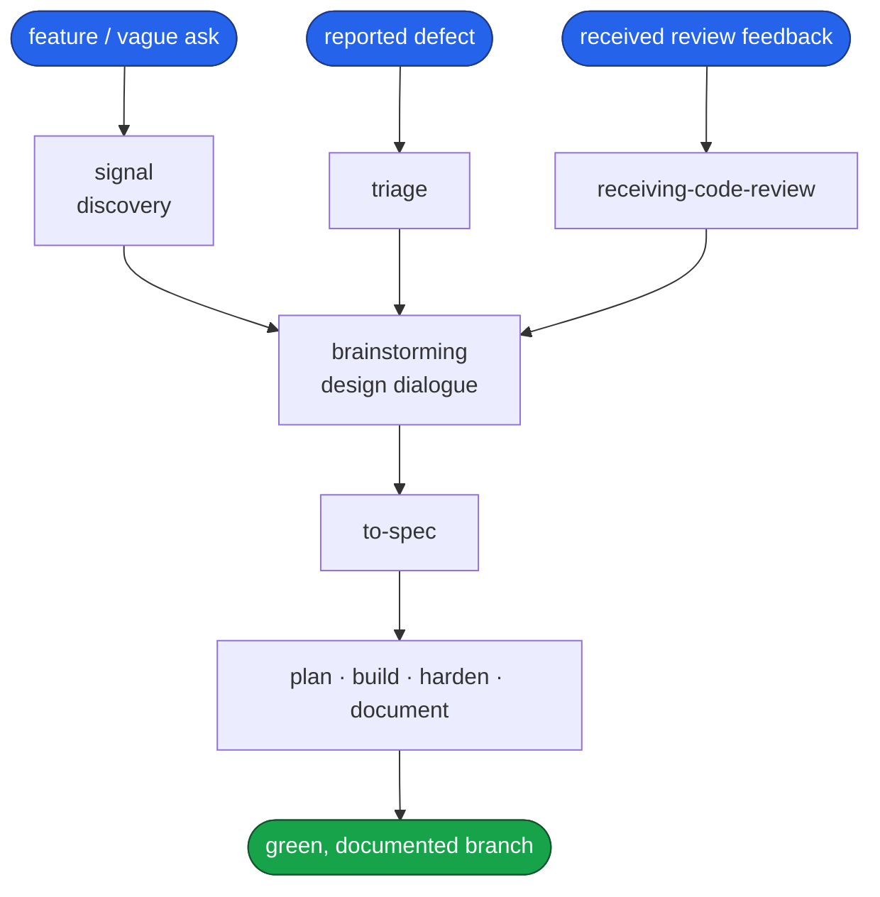
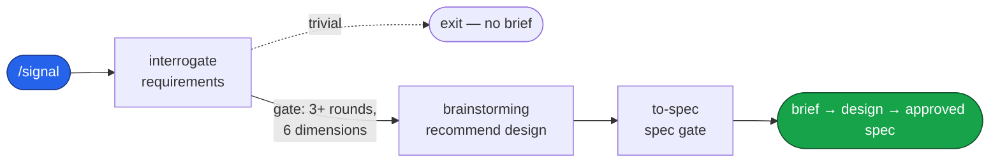
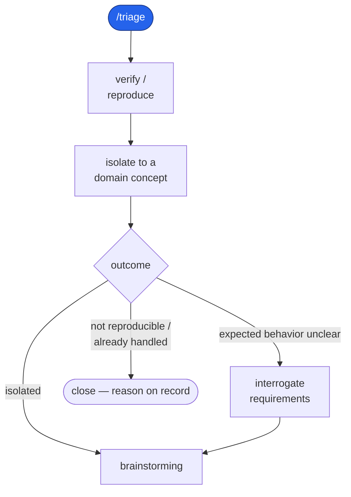
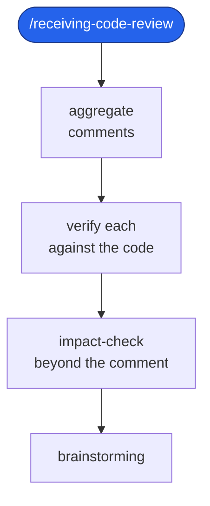
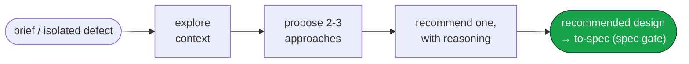
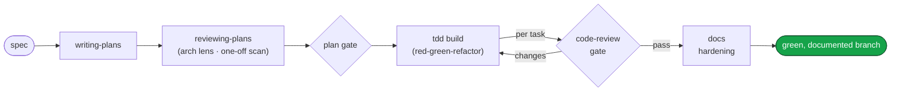

# Engineering

A Claude Code plugin: a complete software-development pipeline that carries a request
from a vague ask — or a reported defect — all the way to a green, documented branch.
File-based from end to end: every artifact the pipeline produces is a file on disk.
The pipeline ends at a green, documented branch — deployment, release, and rollback
are deliberately out of scope.

This repository is the `dashworthy` Claude Code marketplace. Its primary plugin,
`engineering`, carries the whole pipeline; companion plugins ship alongside it, each
installed separately — `laravel` (Laravel pre-commit hooks: Pint, PHPStan, Pest),
`skillsmith` (author, test, and audit Claude skills), `guardtower` (an in-depth,
opt-in code-review gate), and `verity` (standalone test-hardening: harden an arbitrary
branch via `/harden`). See [guardtower/README.md](guardtower/README.md) and
[verity/README.md](verity/README.md).

## Install

```
/plugin marketplace add https://github.com/dashworthy/engineering
/plugin install engineering@dashworthy
```

One install: `engineering` carries the whole pipeline.

## What it does

Work enters through one of three doors and leaves through one. A feature or a vague
request enters at **discover** (`/signal`); a reported defect enters at **triage**
(`/triage`); received review feedback enters at **receiving code review**
(`/receiving-code-review`). All three doors open onto the same **design dialogue**
(`brainstorming`), which recommends a design, then hands off to **`to-spec`**, the single
writer that turns that design into one spec document and holds the pipeline's first
approval gate — on the spec.
From that spec, a fixed backbone runs the work to done: **plan** it, behind the second
gate; **build** it test-first; **harden** the tests; and **document** the prose the
branch touched.



Each phase reads what the phase before it produced; none re-decides what an earlier
phase already settled. The sections below walk each phase in turn.

## The pipeline, phase by phase

### 1. Discover — `signal`

A vague ask becomes a brief, then a recommended design, then an approved spec.
Interrogation probes the request one question at a time, offering a conventional baseline
and mining the correction, until every coverage dimension is filled and `brief.md` §1–§6
is written. The finished brief then passes to `brainstorming` — signal's terminal hand-off
— which recommends a design and hands it to `to-spec`, where the spec gate takes the
human's approval. A genuinely trivial request exits before any brief is written.



### 2. Triage — `/triage`

A reported defect is verified to reproduce and isolated to a domain concept, then handed
to the design dialogue — the same convergence every entrance makes. A report whose expected
behavior is unclear is interrogated for requirements first; one that turns out not to
reproduce, already fixed, or already rejected is closed with the reason on record.



### 3. Receiving code review — `/receiving-code-review`

Review feedback is aggregated, verified against the codebase, and impact-checked — does the
issue reach beyond the line the reviewer pointed at — before any of it is implemented. Each
ask gets a reply on its own thread and a fix stacked onto the original review branch, and
whether to resolve a thread is the user's call once the fix is shown. The shaped feedback
then meets the same design dialogue.



### 4. Design dialogue — `brainstorming`

All three entrances meet here. The design phase explores the context, proposes two or three
approaches with their trade-offs, and recommends one with its reasoning. It holds no
approval gate of its own: brainstorming hands the recommended design to `to-spec`, where
the spec gate takes the human's approval — the pipeline's first human-approval gate.



### 5. Build backbone — `plan → build → document`

Every spec leaves the same way. `writing-plans` turns it into an ordered, bite-sized
plan — each task carrying a code sketch of the change it makes — then `reviewing-plans` runs
the architecture lens over those sketches and flags any one-off data structure before the
plan reaches the second human gate; `/implement` drives each task through a test-first `tdd`
loop gated by `code-review`; and docs hardening rewrites the prose the branch touched into
plain language. (Test hardening is now its own standalone plugin, `verity` — run `/harden`
against a branch when you want it.)



## Skill suite

The plugin ships **20 skills**, grouped by the phase they serve. Process-tied skills
carry their group as a `[Tag]` in the skill's description; cross-cutting skills carry
none.

| Group | Skills |
|---|---|
| Discovery | `interrogating-requirements`, `to-spec` |
| Design | `brainstorming`, `codebase-design` |
| Planning | `writing-plans`, `reviewing-plans`, `executing-plans` |
| Build | `tdd`, `diagnosing-bugs`, `code-review` |
| Docs | `clarifying-docblocks`, `rewriting-docblock-prose` |
| Foundation | `using-git-worktrees`, `using-stacked-pull-requests`, `finishing-a-development-branch`, `verification-before-completion`, `dispatching-parallel-agents`, `using-skills` |
| Cross-cutting | `resolving-merge-conflicts`, `using-diagrams` |

The full index lives at
[engineering/skills/README.md](engineering/skills/README.md).

### Commands

7 slash commands sit on top of the suite: `/signal`, `/triage`, `/receiving-code-review`,
`/vernacular`, `/implement`, `/handoff`, and `/wait-what`.

## License

MIT. See [LICENSE](LICENSE).
