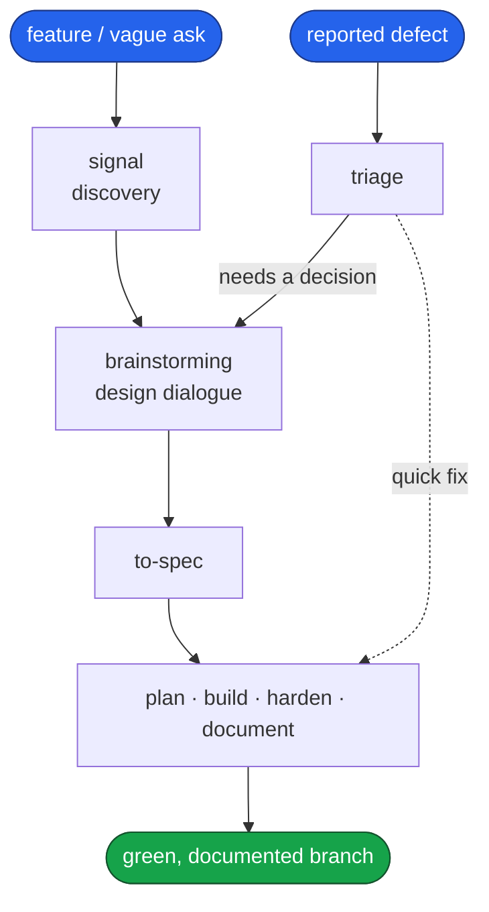
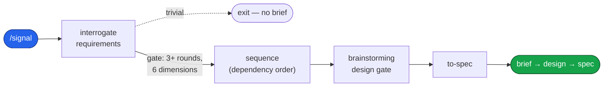
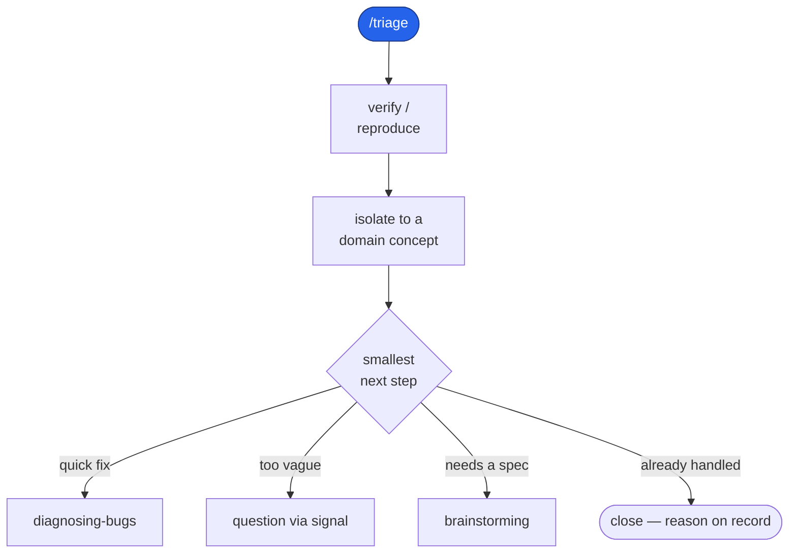
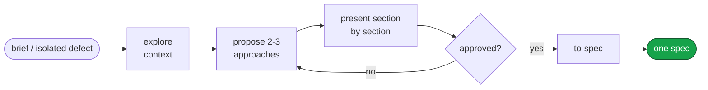
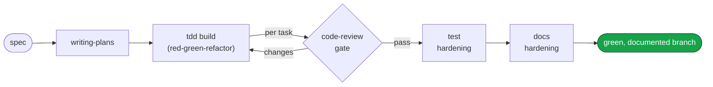

# Engineering

A Claude Code plugin: a complete software-development pipeline that carries a request
from a vague ask — or a reported defect — all the way to a green, documented branch.
File-based from end to end: every artifact the pipeline produces is a file on disk.

This repository is a single-plugin Claude Code marketplace. It publishes one plugin,
`engineering`, and that plugin carries the whole pipeline.

## Install

```
/plugin marketplace add https://github.com/dashworthy/engineering
/plugin install engineering@dashworthy
```

One plugin, one install: `engineering` carries everything.

## What it does

Work enters through one of two doors and leaves through one. A feature or a vague
request enters at **discover** (`/signal`); a reported defect enters at **triage**
(`/triage`). Both doors open onto the same **design dialogue** (`brainstorming`), which
holds a hard approval gate, then hand off to **`to-spec`**, the single writer that turns
an approved design into one spec document. From that spec, a fixed backbone runs the
work to done: **plan** it, **build** it test-first, **harden** the tests, and
**document** the prose the branch touched.



Each phase reads what the phase before it produced; none re-decides what an earlier
phase already settled. The sections below walk each phase in turn.

## The pipeline, phase by phase

### 1. Discover — `signal`

A vague ask becomes a brief, then an approved design, then a spec. Interrogation probes
the request one question at a time, offering a conventional baseline and mining the
correction, until every coverage dimension is filled. A scope-expansion beat then
surfaces adjacent value. Sequencing orders the work by dependency; the finished brief
then passes through the `brainstorming` design gate — signal's terminal hand-off — and
only once the design is approved does `to-spec` render the spec. A genuinely trivial
request exits before any brief is written.



### 2. Triage — `triage`

A reported defect is verified to reproduce, isolated to a domain concept, then routed
to the smallest next step. A quick fix goes straight to `diagnosing-bugs`; a vague
report loops back through `signal` to gather requirements; a change that warrants a
spec goes on to the design dialogue.



### 3. Design dialogue — `brainstorming`

Both entrances meet here. The design phase explores the context, proposes two or three
approaches with their trade-offs, and presents the chosen design section by section. A
hard approval gate holds the line: the design loops until the human explicitly says yes,
and only then does `to-spec` write the one spec.



### 4. Build backbone — `plan → build → harden → document`

Every spec leaves the same way. `writing-plans` turns it into an ordered, bite-sized
plan; `/implement` drives each task through a test-first `tdd` loop gated by
`code-review`; `conducting-test-hardening` closes the gaps a first pass leaves behind;
and docs hardening rewrites the prose the branch touched into plain language.



## Skill suite

The plugin ships **35 skills**, grouped by the phase they serve. Process-tied skills
carry their group as a `[Tag]` in the skill's description; cross-cutting skills carry
none.

| Group | Skills |
|---|---|
| Discovery | `conducting-discovery`, `interrogating-requirements`, `expanding-scope`, `sequencing-requirements`, `to-spec`, `domain-modeling` |
| Triage | `triage` |
| Design | `brainstorming`, `codebase-design`, `improve-codebase-architecture`, `prototype` |
| Planning | `writing-plans`, `executing-plans` |
| Build | `tdd`, `diagnosing-bugs`, `code-review`, `requesting-code-review`, `receiving-code-review` |
| Test hardening | `conducting-test-hardening`, `auditing-test-gaps`, `verifying-test-integrity`, `writing-tests-from-brief` |
| Docs | `clarifying-docblocks`, `rewriting-docblock-prose`, `verifying-docblock-claims` |
| Foundation | `using-git-worktrees`, `using-stacked-pull-requests`, `finishing-a-development-branch`, `verification-before-completion`, `dispatching-parallel-agents`, `writing-skills`, `using-skills` |
| Cross-cutting | `research`, `resolving-merge-conflicts`, `using-diagrams` |

The full index lives at
[engineering/skills/README.md](engineering/skills/README.md).

### Commands

Eight slash commands sit on top of the suite: `/signal`, `/triage`, `/vernacular`,
`/improve-codebase-architecture`, `/implement`, `/handoff`, `/to-signal`, and
`/wait-what`.

## License

MIT. See [LICENSE](LICENSE).
