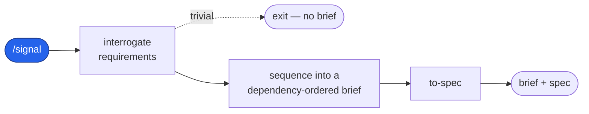
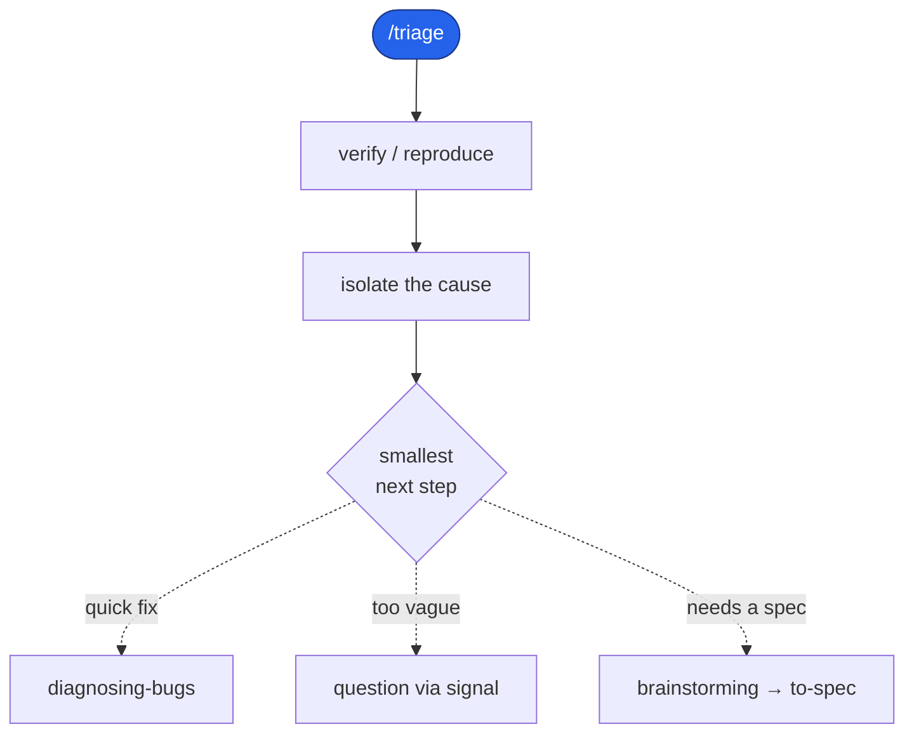
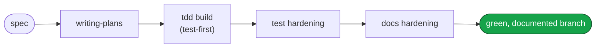

# Engineering

A Claude Code plugin: a complete software-development pipeline that carries a request
from a vague ask through to a green, documented branch. Discovery or triage in; a
hardened, documented branch out. Every artifact is a file — there is no external tracker.

This repository is a single-plugin Claude Code marketplace: it publishes one plugin,
`engineering`, which carries the whole pipeline.

## Install

```
/plugin marketplace add https://github.com/dashworthy/engineering
/plugin install engineering@dashworthy
```

One plugin, one install — `engineering` carries everything, so there is nothing else to
add on top of it.

## Pipeline overview

Work enters through one of two doors. A feature or a vague request starts at
**discover**; a reported defect starts at **triage**, which isolates the problem before
deciding how far it needs to go. Both doors open onto the same **design dialogue**
(`brainstorming`): a forced comparison of two or three approaches, worked through
section by section, that will not let anything downstream start until you've
explicitly approved a direction. Approval hands off to **`to-spec`**, a single writer
that turns the approved design into one spec document.

From the spec, the rest of the pipeline runs in a fixed order: **plan** the work,
**build** it test-first, **harden** the tests against the gaps a first pass tends to
leave behind, and **document** whatever prose the branch touched. Each phase reads what
the phase before it produced; none of them re-decide what an earlier phase already
settled.

### At a glance

**Signal — a vague ask becomes a brief and a spec, then stops.** The scope-expansion
beat runs inside interrogation; a genuinely trivial request exits before any brief is
written.



**Triage — isolate a reported defect, then take the smallest next step.** Only the
spec route rejoins the backbone directly; a questioning loops back through signal first.



**Backbone — every spec leaves the same way.** Whichever entrance produced it, a spec
runs this fixed order to a green, documented branch.



### What it doesn't do

- **No issue tracker.** Every artifact is a file. Even triage, which exists specifically
  to isolate a reported problem, logs its findings to a disposable run directory rather
  than opening a ticket anywhere.
- **CONTEXT.md and ADRs are optional.** The design and build phases read them when
  they exist and carry on fine when they don't. Nothing in the pipeline demands you
  maintain either.
- **Scratch output is disposable.** Everything a run produces along the way lives under
  a gitignored, per-run scratch directory. It's safe to delete; nothing durable depends
  on it surviving.
- **Skills stay flat.** The plugin doesn't nest its skills into subdirectories to show
  relatedness — grouping comes from naming and a README index, not folders.

## Skill suite

The plugin ships **32 skills**, grouped by the phase they serve. Process-tied skills
carry their group as a `[Tag]` in the skill's description; cross-cutting skills carry
none.

| Group | Skills |
|---|---|
| Discovery | `conducting-discovery`, `interrogating-requirements`, `expanding-scope`, `sequencing-requirements`, `to-spec`, `domain-modeling` |
| Triage | `triage` |
| Design | `brainstorming`, `codebase-design`, `improve-codebase-architecture`, `prototype` |
| Planning | `writing-plans`, `executing-plans` |
| Build | `tdd`, `diagnosing-bugs`, `code-review` |
| Test hardening | `conducting-test-hardening`, `auditing-test-gaps`, `verifying-test-integrity`, `writing-tests-from-brief` |
| Docs | `clarifying-docblocks`, `rewriting-docblock-prose`, `verifying-docblock-claims` |
| Foundation | `using-git-worktrees`, `finishing-a-development-branch`, `verification-before-completion`, `dispatching-parallel-agents`, `writing-skills`, `using-skills` |
| Cross-cutting | `research`, `resolving-merge-conflicts` |

The full index lives at
[engineering/skills/README.md](engineering/skills/README.md).

### Commands

Eight slash commands sit on top of the suite: `/signal`, `/triage`, `/vernacular`,
`/improve-codebase-architecture`, `/implement`, `/handoff`, `/to-signal`, and
`/wait-what`.

## License

MIT. See [LICENSE](LICENSE).
