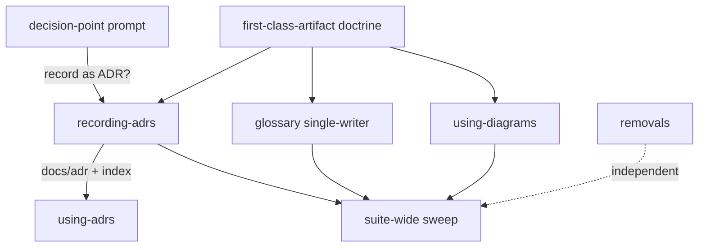
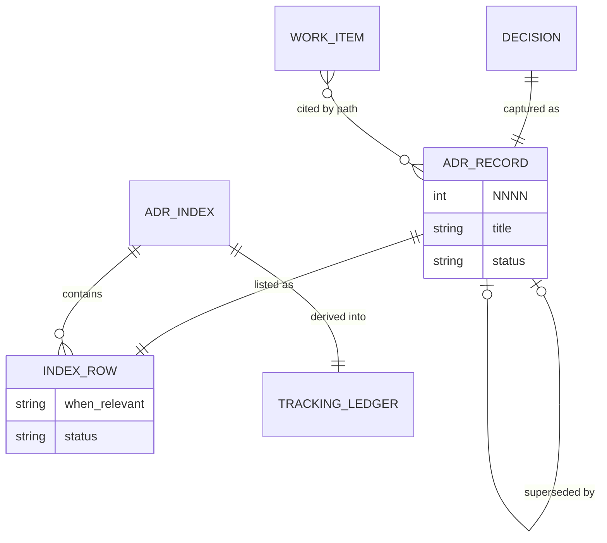

# First-class edge artifacts (ADRs, glossary, diagrams) — spec

**Date:** 2026-08-26
**Author:** Andrew Leach
**Status:** Approved
**Origin:** signal (discovery) — `.engineering/2026-08-26-first-class-adrs/signal/brief.md`

## 1. Problem

Decisions get made at many phases of the engineering pipeline — discovery, design, planning, build, review — but are never captured as ADRs, so the suite has no reference trail and no tracking of *why* things were chosen. `domain-modeling` can write `docs/adr/` and `CONTEXT.md`, but it only runs on manual invocation, and ~13 downstream skills consume both artifacts with the same passive phrase — "read CONTEXT.md / docs/adr when present." Nothing is obligated to *produce* a decision record when a decision is made, and nothing is obligated to *consult* one. ADRs and the glossary are optional conveniences that rot on the edges rather than living infrastructure — the same passive-consumption idiom afflicts other edge skills (`prototype`, `research`) too.

Felt by: developers (Claude + human pairs) running the suite, who re-derive or re-litigate decisions already argued out; and later readers with no trail for why a choice was made.

## 2. Users & stakeholders

- **Primary users:** developers — Claude + human pairs — running the pipeline (signal → design → plan → build → review).
- **Affected:** later readers needing the decision trail (reference + tracking); every downstream skill that currently reads `docs/adr/` and `CONTEXT.md` passively.
- **Decides / signs off:** the suite maintainer.

## 3. Goals & success criteria

Each is observable and checkable. Done means all hold:

1. **ADR recording is wired to decision points.** Design, planning, and review phases each carry a trigger that surfaces an ADR candidate when a decision with live alternatives is made — no longer waiting for `domain-modeling` to be summoned.
2. **An ADR index exists** — `docs/adr/index.md`, mirroring `docs/standards/index.md`: ADRs are findable and matchable, not a bare pile of numbered files.
3. **Using-ADRs is active, not passive.** Downstream skills cite the governing ADR by path, at the work item (mirroring `using-code-conventions`), replacing every "read docs/adr when present."
4. **The glossary gets the same active treatment.** `CONTEXT.md` consumption shifts from "when present" to an obligation at the phases needing term-grounding, and it is updated at term-introduction points.
5. **`using-diagrams` is wired in.** At least one authoring phase (spec / ADR / plan) is obligated to *consider* a diagram when a data model, flow, or state machine is described.
6. **`prototype` and `research` are removed cleanly.** Directories gone, no dangling references, `skills/README.md` index updated, `dispatching-parallel-agents` scrubbed of the `research` reference, test suite green (`acceptance.sh` / `plan03.sh` updated, not broken).
7. **An ADR trilogy structure exists** — an intake concern, a single-writer, and a using concern are each identifiable.
8. **An ADR tracking view exists** — a per-run / per-phase decision ledger showing which decisions landed and their status (Proposed vs Accepted), distinct from the index's lookup role.
9. **ADR lifecycle is managed** — Proposed → Accepted transitions and Superseded-by handled, with the index kept in sync, so the trail reflects what is in force.
10. **A reusable "first-class edge artifact" doctrine is defined once and applied to all three** — the intake-trigger + index + active-consumption treatment is one named pattern, and ADRs, glossary, and diagrams are each wired to it.
11. **The ADR→convention spawn bridge is removed** — the hand-off rule is deleted from `domain-modeling` and its references (e.g. in `recording-code-conventions`) scrubbed.
12. **No passive "read when present" idiom remains in the suite** — every skill/command carrying it (~13+ consumers) is converted to an active obligation.

## 4. Constraints

- Markdown-skill plugin (Claude Code / Agent SDK); the deliverable is skill prose, formats, and wiring — **not application code**.
- Mirror the conventions trilogy shape (intake → single-writer → use) plus an index with a match column — but adapt, not copy: an ADR is a point-in-time record, not a standing rule, so it does **not** inherit the convention hardening-interrogation / individual-approval gate.
- Preserve suite discipline: single-writer per artifact, no silent writes.
- **Must not flood.** The recording trigger fires only on decisions with genuine live alternatives; the developer can decline.
- ADRs are append-only and numbered (superseded by pointer, never rewritten); the glossary is living and mutable. The using / tracking / lifecycle mechanisms respect both models via two consumption profiles (§6), not one shape forced on both.
- **The doctrine is defined before it is applied** — the pattern is settled first, then the three artifacts are wired to it.
- **Large blast radius.** The suite-wide sweep touches every "when present" consumer (~13+ files) plus removals and bridge-scrubbing; the whole suite must stay working.
- Worktree-first workflow.

## 5. Scope

**In:**

- **Doctrine** — a `first-class-artifact` reference defining the pattern (intake trigger + index + active-consumption obligation) with two consumption profiles: *trail* and *lookup*.
- **ADRs, first-class** — `recording-adrs` (single writer, owns `docs/adr/` + `docs/adr/index.md` + lifecycle + tracking ledger; intake = prompt at the decision point) and `using-adrs` (thin; match index → cite by path).
- **Glossary, first-class** — `domain-modeling` shrinks to the `CONTEXT.md` single-writer; intake at term-introduction; active consumption via the sweep (lookup profile).
- **`using-diagrams`, first-class** — intake obligation in authoring phases to *consider* a diagram.
- **Suite-wide passive→active sweep** — convert every "read when present" reference (~13+ skills/commands) to an active obligation.
- **Remove** the ADR→convention spawn bridge, the `prototype` skill, and the `research` skill (each cleanly: scrub refs, update README index and tests).

**Out (non-goals):**

- The docblock / vernacular cluster (`clarifying-docblocks`, `rewriting-docblock-prose`, `verifying-docblock-claims`) — coherent, with its own `/vernacular` command entrance; not an edge artifact. *Reason: it is not underutilized.*
- An `identifying-adrs` scanner skill — *reason: a decision surfaces inside the phase that makes it, so ADR intake is an in-phase obligation, not a standalone discovery pass.*

**Deferred:** none. Every expansion candidate was adjudicated in-scope (the spawn-bridge candidate in-scope as a removal).

## 6. Approach (from the design dialogue)

**Chosen: Approach B — doctrine + single writer + threaded obligations.**

A single **doctrine** names the first-class pattern once: *intake trigger + index + active-consumption obligation*, with **two consumption profiles** that resolve how a living glossary and an append-only ADR trail are each consumed:

- **Trail profile** (ADRs) — append-only historical record; a consumer cites the governing decision *by path, at the work item*.
- **Lookup profile** (glossary) — living current-state; a consumer resolves the *current* meaning of a term.

ADRs then get a real but lightweight trilogy: a single-writer skill `recording-adrs` owning `docs/adr/`, the `docs/adr/index.md`, the lifecycle, and the tracking ledger; a thin `using-adrs` mirroring `using-code-conventions`; and **intake as an obligation clause threaded into the phases that make decisions** (brainstorming, codebase-design, writing-plans, code-review) rather than a standalone scanner. The **intake trigger is a prompt at the decision point**: when a phase reaches a decision with live alternatives, it offers "record as ADR?", writes it `Proposed` on a yes, and captures the reasoning while live; it fires only on genuine alternatives, so it does not flood. Lifecycle: `Proposed` → `Accepted` when the carrying spec/plan clears its approval gate; `Superseded by NNNN` handled by the writer; index synced in the same edit. The glossary is the same pattern under the lookup profile, with `domain-modeling` reduced to its single-writer. Diagrams get an authoring-phase obligation to *consider* (not always draw) a picture. A suite-wide sweep converts every remaining passive reference to an active obligation, using the exemplars from ADRs, glossary, and diagrams as the template.

Nodes are the real skill/artifact names. The doctrine seeds `recording-adrs`, the glossary single-writer, and `using-diagrams`; the decision-point prompt feeds `recording-adrs`, which produces `docs/adr/` and the index that `using-adrs` matches against; the three exemplars feed the suite-wide sweep; the removals run independently.

**Alternatives weighed:**

- **A — full trilogy mirror (rejected):** mint `identifying-/recording-/using-` skills per artifact and dissolve `domain-modeling` (~6 new skills). Rejected as over-structured — it applies the convention *standing-rule* gate (hardening interrogation + individual approval, which exist to pin is/is-not boundaries) to point-in-time records that have no such boundaries, buying weight with no payoff.
- **C — registry-spine, minimal (rejected):** one tiny skill owns a registry doubling as the ledger; intake and using are bare "see the registry" pointer lines; doctrine implicit. Rejected because "define the doctrine once as a named pattern" is a success criterion C only weakly meets, and a bare pointer line is close to the passive rot being removed.

**Spec scope decision:** one Tier-1 spec covers the whole coherent design; `writing-plans` splits it into a plan set along the brief's §7 dependency order (components A–K).

## 7. Existing context

What the work touches:

- **`domain-modeling`** — current writer of `CONTEXT.md` (glossary) and `docs/adr/`; ~0 inbound pipeline routes. Holds the **ADR→convention spawn bridge** ("Spawning a convention from an ADR") slated for removal.
- **`ADR-FORMAT.md`** — record shape `# NNNN. Title` / Status (Proposed | Accepted | Superseded by NNNN) / Context / Decision / Consequences; four-digit sequential numbering, append-only. Its status vocabulary and supersession are exactly what the lifecycle work drives.
- **`CONTEXT-FORMAT.md`** — the glossary shape the shrunk `domain-modeling` keeps.
- **Conventions trilogy** — the model to adapt: `identifying-code-conventions` (intake), `recording-code-conventions` (single writer + two gates + index), `using-code-conventions` (reads `docs/standards/index.md`, matches the **"When relevant"** column, cites by path, skips retired rows). `STANDARDS-FORMAT.md` defines the 8-column index; `recording-code-conventions` names an "ADR-spawn seam" and records spawning ADRs as `Source` provenance — both scrubbed when the bridge is removed.
- **Passive consumers (~13, the sweep's targets):** code-review, codebase-design, writing-plans, tdd, triage, diagnosing-bugs, improve-codebase-architecture, and others read `CONTEXT.md` / `docs/adr/` "when present"; the `handoff` / `wait-what` commands too.
- **Removal blast radius:** `skills/prototype/` (referenced by nothing), `skills/research/SKILL.md` (referenced only by `dispatching-parallel-agents`), plus `skills/README.md` and the `acceptance.sh` / `plan03.sh` tests. `plugin.json` auto-discovers skills — no manifest edit.

The artifacts and their relationships (what the tracking/using work turns on):

`status` on `ADR_RECORD` and `INDEX_ROW` takes `Proposed`, `Accepted`, or `Superseded`; `when_relevant` is the match column `using-adrs` scans. The `TRACKING_LEDGER` is derived from the index, not a separate source of truth. `WORK_ITEM`↔`ADR_RECORD` is the `using-adrs` by-path citation.

## 8. Open questions

Neither blocks starting:

- **`removal-cleanliness`** (open thread) — the three removals must leave no dangling reference, and the tests that name `prototype` / `research` (`acceptance.sh`, `plan03.sh`) must be *updated*, not left broken. A concern for the removal components, not a design gap.
- **`glossary-vs-adr-consumption`** (thread) — resolved by design via the two consumption profiles (trail vs lookup); flagged here so a reader knows the resolution is a design choice, not an accident. Re-open only if a profile proves too coarse for a specific consumer during the sweep.
- **Tracking-ledger form** — whether the per-run/per-phase ledger is a distinct file or a filtered view over `docs/adr/index.md` is left to `codebase-design` / the plan; §3.8 only requires that the tracking view exist and be distinct from lookup.
- §2 stakeholders are an agreed baseline (from the brief's coverage table), not independently elaborated.
