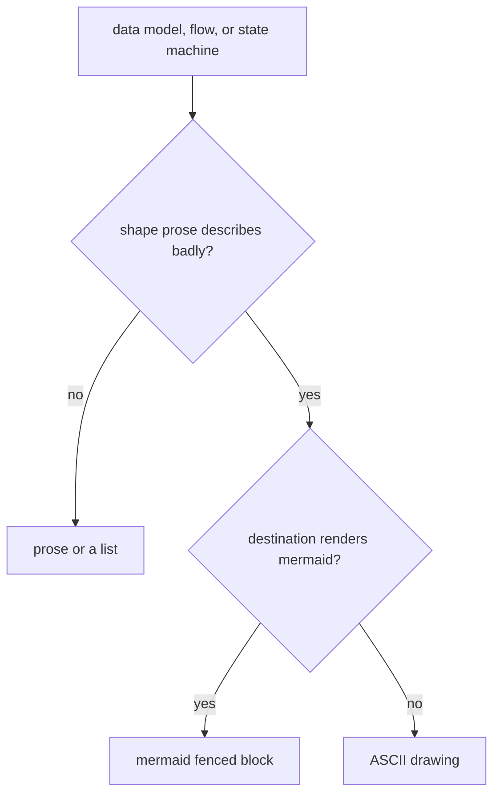

# Using diagrams

**When a data model, a flow, or a state machine would be clearer as a picture, the pipeline draws
exactly one diagram — a mermaid block where the surface renders markdown, ASCII where it doesn't —
but only when the shape is one prose describes badly.**

---

## 🌟 Overview (plain-language)

Specs, plans, pull requests, and feature docs are mostly prose, but some things read better as a
picture: how records reference each other, the order a process runs in and where it branches, the
statuses a thing moves between. The **using-diagrams** foundation is what those documents reach for
when a shape like that comes up. It is cross-cutting — any phase can invoke it — and it does one
narrow job: turn a decision already made into a single, honest diagram at the spot the reader meets
the concept.

The rule that keeps it from cluttering every document is the **earned-its-place test**. When a
document describes a data model, a flow, or a state machine, the author *considers* a diagram — the
guard is consider, not always draw. A diagram is drawn only when the thing has a shape prose
describes badly. If a picture would just restate the sentence beside it, it stays undrawn.

**Worked example.** A spec's approach reads: "The request is validated; a valid one is enriched and
persisted, an invalid one is rejected, and a persist that misses the cache falls through to the
upstream." That is a flow with two branch points, and a reader has to hold the whole sentence in
their head to see where it forks — it earns a flowchart. Contrast a plan step that reads: "Read the
config file, then start the server." That is a single linear call. Drawing two boxes and an arrow
for it adds a picture the reader has to read past to reach the point. The first earns its place; the
second is a list, and stays one.

Once a diagram is earned, one more decision settles how it's written: the **medium fork**. The
predicate is whether the destination renders a fenced mermaid block, not whether the filename ends
in `.md`. A spec, plan, PR description, or a feature doc like this one renders markdown, so the
diagram is **mermaid**. A source-code comment, a commit-message body, or a plain-text file does not,
so the diagram is **ASCII** — a mermaid fence there would sit as unrendered source, a worse picture
than a plain drawing.

Both of those decisions are themselves a small branching flow, which is exactly the kind of shape
that earns a diagram — so here is that shape, drawn:



The shapes the skill anchors on, and what each is for:

| Kind | Draw it for | mermaid type |
|---|---|---|
| **ER diagram** | entities or records and how they reference each other, with cardinality | `erDiagram` |
| **Process-flow diagram** | a process or pipeline with an order and branches | `flowchart` / `graph` |
| **Sequence diagram** | messages crossing a process boundary — request paths, queue flows | `sequenceDiagram` |
| **Lifecycle / state diagram** | the statuses a thing moves between and the transitions | `stateDiagram-v2` |

ER and process flow are the two the skill points at first; sequence and lifecycle are fair game
whenever they fit the shape, not a fence around what mermaid can draw.

## 🛠 Technical reference

The detail a reader who will change how the pipeline diagrams needs.

**Architecture.** The skill owns the decision and the format; several documents compose it to render
their diagrams at the point of introduction.

| Area | Unit | Responsibility |
|---|---|---|
| Skill | `engineering/skills/using-diagrams/SKILL.md` | Owns the earned-its-place test, the consider-not-always authoring obligation, the medium fork (mermaid vs. ASCII), and the artifact escalation for a shape too big for a static block. Draws a decision already made; does not make it or author the surrounding document. |
| Format | `engineering/skills/using-diagrams/DIAGRAM-FORMAT.md` | Concrete copy-from templates for ER, process-flow, sequence, and lifecycle shapes in both mediums, plus the GitHub-compatible mermaid rules and the diagram-craft rules (label every edge, use real names, gates on edges). |
| Width rule | `engineering/skills/using-diagrams/references/diagram-rules.md` | The single width budget for the ASCII-in-a-docblock case — 72 columns including the comment leader, light box-drawing characters only. |
| Consumer — spec | `engineering/skills/spec/SKILL.md`, `engineering/skills/spec/references/SPEC-FORMAT.md` | Carries the consider-a-diagram obligation and places an ER diagram in §7 (or §6 when the model is the approach) and a process-flow diagram in §6. |
| Consumer — plan | `engineering/skills/plan/SKILL.md` | Carries the consider-a-diagram obligation for the plan it authors. |
| Consumer — feature doc | `engineering/skills/using-documentation/references/FEATURE-DOC-TEMPLATE.md`, `engineering/skills/using-documentation/SKILL.md` | Renders ER, flow, and state diagrams via the skill at the point of introduction — an ER diagram in the technical reference, a process-flow diagram in the overview where a flow branches. |

**Boundaries & invariants.**

- **Earned its place, not always drawn.** A diagram must beat the prose beside it. The obligation is
  to *consider* one when a data model, flow, or state machine appears — never to draw one on every
  such mention. A diagram that only repeats its neighbouring sentence is decoration, and decoration
  is noise.
- **Never draw for** a single linear call, a restatement of the sentence above it, or box art around
  a label.
- **The medium follows the destination, not the file extension.** Mermaid only where the surface
  actually renders a fenced block; ASCII everywhere a mermaid fence would sit as literal, unrendered text.
- **Format and rules live in `DIAGRAM-FORMAT.md`.** Mermaid must be GitHub-compatible: fence at
  column 0 with exactly three backticks and `mermaid`, one diagram per block, core diagram types
  only, quote any label carrying a breaking character, and no `%%{init}%%` theme directives or
  `click`/JS interactions (GitHub strips them).
- **Every mark traces to real material.** An entity, edge, or step the source never established is a
  confident-looking line with nothing behind it — worse than a gap, because a picture reads as
  settled fact. Where the shape is genuinely unknown, say so in prose and leave it undrawn.
- **It draws, it does not decide.** The approach a flow pictures was argued in brainstorming; the
  boundary an ER model reflects was shaped by using-codebase-design. The skill supplies a diagram
  for a document to hold; it does not author the document or make the decision it depicts.

## 🚀 Development & testing

The foundation is skills and shell checks, so its tests are structural assertions over the skill and
its consumers. Run the full suite, which is what CI runs:

```bash
sh engineering/tests/suite.sh
```

The diagram-specific assertions live in two of the suite's checks:

```bash
sh engineering/tests/validate.sh            # diagram-rules width budget + the consider-a-diagram
                                            # obligation on using-diagrams and the authoring phases
sh engineering/tests/using-documentation.sh # the feature-doc producer composes using-diagrams
```

`validate.sh` asserts that `references/diagram-rules.md` exists and states the 72-column width
budget, that `SKILL.md` states the consider-a-diagram obligation, and that the authoring phases
(`spec`, `plan`) each carry that obligation via `using-diagrams`. To change the earned-its-place
test or the medium fork, edit `SKILL.md`; to change a template or the GitHub-compatibility rules,
edit `DIAGRAM-FORMAT.md`; to change the ASCII width budget, edit `references/diagram-rules.md`.
