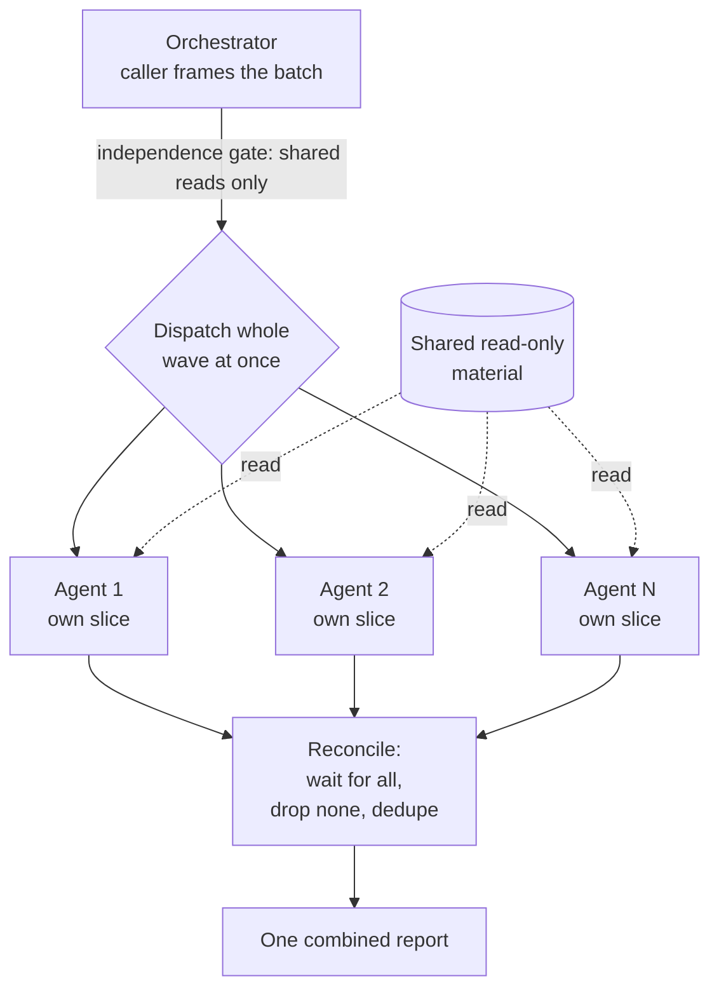

# Parallel agents

**The foundation the pipeline uses to run two or more genuinely independent tasks at the same time — it enforces the rule that lets them run together, sends the whole batch out at once, and gathers every result back before anything is built from them.**

---

## 🌟 Overview (plain-language)

Some work splits cleanly into pieces that don't need each other. When it does, running the pieces one after another wastes time — each one could have been happening while the others ran. This foundation, the **using-parallel-agents** skill, is the shared machinery for doing that split safely: it fans the pieces out to **parallel agents** running concurrently, then reconciles what they send back into one result.

It owns exactly two guarantees and nothing else. First, the **independence gate**: it only ever runs in parallel work that shares no mutable state. Second, the **fan-out and reconcile**: it dispatches the whole batch at once and brings every return back whole — nothing dropped because it answered last, nothing silently chosen because it answered first. What the pieces are, and what the combined result should look like, belongs to whoever calls it.

**The independence gate** is the rule the rest stands on. Two units are independent when neither reads what the other writes and neither writes what the other reads. Two agents editing the same file are not independent. One agent that needs an artifact another produces partway through is not independent. But two agents merely *reading* the same file share nothing that breaks the gate — reading in common is fine; writing, or depending on another's order, is the hazard. The caller must be able to say, for every pair in the batch, which of them touches what the other does; if it can't, the answer is to stop and split the work into ordered waves, never to guess and fan out anyway.

**Worked example — the build review fan-out.** When a task's diff clears the inline floor, the build phase's review protocol checks it several ways at once: does it stand as good code on its own terms, does it do what the spec asked, and does every docblock read clearly to someone outside the team. Those lenses are independent — each one only *reads* the same finished diff plus its own slice of material (the standards, the spec, the changed prose), and none of them writes anything the others read. So the review protocol hands each lens to its own reviewer and dispatches them all at once:

| Reviewer | Reads (shared + its own slice) | Returns |
|---|---|---|
| Standards | the diff + the coding standards | code that is poor on its own terms |
| Spec | the diff + the run's spec | behavior that misses what was asked |
| ELI5 | the diff + its changed docblocks | prose an outside reader couldn't follow |

The foundation waits for all of them to come back, then reconciles them into one report grouped by reviewer: a reviewer that found nothing is reported as a clean lens, not a missing one; a problem two reviewers both raise is carried once, not twice. The build loop reads that single report and fixes each finding in the task's own diff. The reviews happened at once instead of one after another, and the caller got back one coherent result rather than several loose ones.



## 🛠 Technical reference

The detail a reader who will change the wiring needs.

- **No data of its own.** This foundation owns no state, no task, no file. It is a primitive: a caller supplies the split and the return contract, and the skill runs the wave and gathers the returns. Everything below is behavior, not schema.

- **Architecture.** The skill states the contract; each caller supplies its own split and reconcile shape.

  | Area | Unit | Responsibility |
  |---|---|---|
  | The primitive | `skills/using-parallel-agents/SKILL.md` | States the independence gate, sends the whole wave of `Agent` calls at once, and gathers every return whole before synthesis. Owns the mechanics; owns no task, split, or reconcile shape. |
  | Consumer — build review | `skills/build/references/review-protocol.md` | Orchestrates the per-axis code review: one sub-reviewer per lens above the inline floor, fanned out via this skill, reconciled into one report. |
  | Registry | `README.md` | Lists `using-parallel-agents` among the cross-cutting skills any phase may invoke. |

- **Boundaries & invariants.** The rules a caller must respect — stated here so the next reader does not learn them by breaking one.

  | Invariant | What it means |
  |---|---|
  | Independence gate — shared reads only | Dispatch in parallel only what shares no mutable state. Reading the same material in common is allowed; two agents writing the same thing, or one depending on another's mid-flight output, is not. Establishing the gate holds is the caller's job — the skill cannot inspect a domain — but the skill refuses to proceed past a batch where nobody made that judgment. |
  | Reconcile drops nothing, duplicates nothing | Wait for the entire wave before writing, deciding, or reporting. A return is never dropped for answering last, nor silently chosen for answering first. A reviewer that came back empty is reported clean, not omitted. Where two returns disagree, the disagreement is written down as its own finding with both sides named — not resolved by quietly favoring the more confident one. An agent that errors or times out is reported as part of the outcome, not papered over with an invented stand-in. |
  | Don't spawn below break-even | A fan-out has a fixed cost — spinning up each subagent plus the reconcile pass. When the work is small enough that this cost exceeds what parallelism saves, the caller applies the checks inline in one pass instead. The primitive itself owns only the coarse rule — below two units there is nothing to gate; the **inline floor** (below it, do the work inline; above it, fan out) is the *caller's* to set, in its own orchestrator reference. Don't spawn an agent whose payload is smaller than its own fixed cost. And match the split to what's actually independent — two real units beat five artificial slices of one unit, which only multiply reconcile work without adding parallelism. |

## 🚀 Development & testing

This foundation is a skill plus the callers that wire into it, so its tests are structural assertions in the shell suite — they check that consumers still route their fan-out through this skill and keep the inline floor, rather than exercising a running dispatch.

```bash
# Run the full foundation suite (what CI runs)
sh engineering/tests/suite.sh
```

The checks that bear on this foundation:

| Test | Asserts |
|---|---|
| `engineering/tests/validate.sh` | The build review-protocol orchestrator fans out via `using-parallel-agents` and keeps the small-diff inline floor. |

To change the fan-out or reconcile contract itself, edit `engineering/skills/using-parallel-agents/SKILL.md`. To change how a specific caller splits its work or where its inline floor sits, edit that caller's orchestrator reference (`review-protocol.md`), not the primitive.
