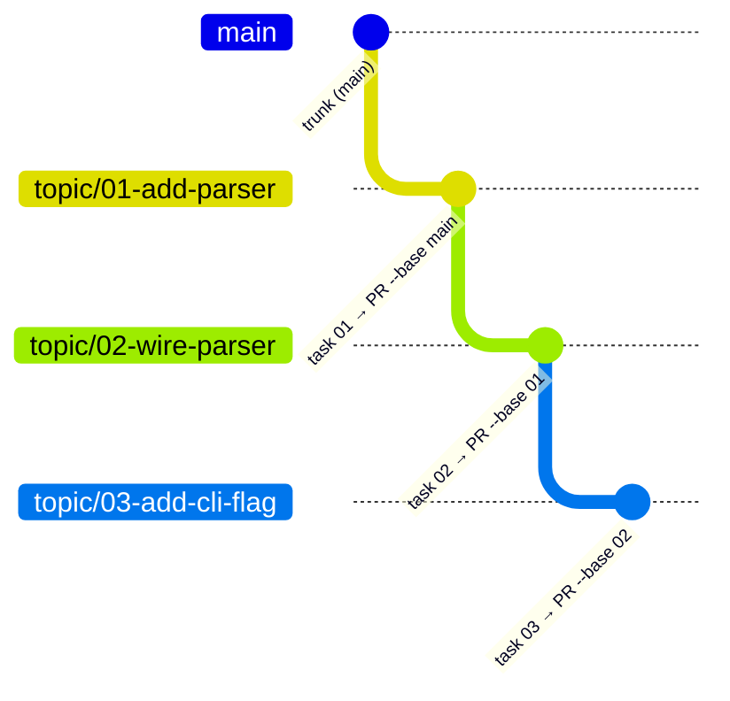

# Stacked pull requests

**Ships an approved plan as a linear stack of pull requests — one branch and one PR per task, each based on the task below it — using nothing but `git` and `gh`, and never merging: a human lands the stack.**

---

## 🌟 Overview (plain-language)

When a plan is built task by task, the work could all land on one branch and open as one giant pull request — a reviewer then has to untangle every task from every other. A **stacked pull request** run avoids that: each task gets **its own branch** and **its own pull request**, and each PR is based on the branch below it rather than on the trunk. A reviewer opening task 2's PR sees only task 2's diff, because everything task 1 added is already in task 2's base.

The branches form a **linear chain**. The first task's branch is cut from the **trunk** — the branch the work will eventually merge into. Every later task's branch is cut from the previous task's branch, so task 2 starts where task 1 ended, task 3 starts where task 2 ended, and so on. The PRs mirror the chain: task 1's PR targets the trunk, task 2's PR targets task 1's branch, task 3's PR targets task 2's branch.

This foundation is the **baseline `git` + `gh` mechanics** — the path taken when Graphite (`gt`) is absent, which is the assumed case in a bare repository. It owns two moves: **starting a task's branch** off the correct parent before the task's commits land, and **submitting a task's PR** against that parent once the commit exists. (The skill also drives Graphite when a repo already uses it, but the mechanics below are the ones that run without it.)

**Worked example — a three-task plan.** The plan targets trunk `main` and its Global Constraints carry `PR strategy: stacked`. Building it produces:

| Task | Branch cut from | PR base (`--base`) | PR head (`--head`) |
|---|---|---|---|
| 01 add-parser | `main` (trunk) | `main` | `topic/01-add-parser` |
| 02 wire-parser | `topic/01-add-parser` | `topic/01-add-parser` | `topic/02-wire-parser` |
| 03 add-cli-flag | `topic/02-wire-parser` | `topic/02-wire-parser` | `topic/03-add-cli-flag` |

Three tasks become three stacked branches and three pull requests, each showing only its own diff. The pipeline opens (or refreshes) all three and stops there. A human reviews them and **lands them bottom-up** outside the pipeline: merge PR 01 into `main` first, restack what remains onto the new `main`, then merge PR 02, and so on up the chain.



The stack is read bottom-up for landing: PR 01 merges first, then 02, then 03 — each PR merges only after the one beneath it, and the human does every merge.

## 🛠 Technical reference

**Architecture.** The mechanics live in one skill; three pipeline phases drive it, and one shell test pins its prose.

| Area | Unit | Responsibility |
|---|---|---|
| Mechanics | `skills/using-stacked-pull-requests/SKILL.md` | Owns branch-start and submit-PR. Cuts task N's branch from task N-1's branch (`git switch -c <topic>/<NN>-<task-slug> <parent-branch>`) and opens its PR with `gh pr create --base <parent> --head <task>`, taking title and body from the task. Restacks children with `--force-with-lease` and `gh pr edit --base` when a lower PR changes. Must not merge. |
| Trigger | `skills/plan/SKILL.md` | Writes `PR strategy: stacked` into a plan's Global Constraints and emits, per task, a branch-start step and a submit-PR step. Every plan ships stacked; there is no single-PR alternative and no parallel fan-out. |
| Execution | `skills/build/SKILL.md` | Reads the PR strategy, runs the tasks sequentially, and lands each task's commit on that task's own branch before its PR is submitted. |
| Integration | `skills/finish/SKILL.md` | Opens the stacked PRs already sitting on the branch and delegates to the skill; states that a human lands the stack bottom-up, outside the pipeline. Offers no merge-directly option and issues no merge command. |
| Covering test | `tests/stacked-prs.sh` | Content gate. Pins the required prose across all of the above via flattened fixed-string anchors, and forbids any merge command (`gh pr merge`) from creeping back in. |

**PR body from the task.** A PR's title and body come from the task itself — the same way the commit message is taken from the task's final step — not composed fresh at submit time. Re-running submit on a task that already has a PR updates that PR instead of opening a second one.

**Boundaries & invariants.**

- **A linear stack means sequential tasks.** Because task N's branch is cut from task N-1's, the tasks build in a single chain in plan order — there is no parallel fan-out. A task whose commits land on the parent branch by accident collapses two tasks into one PR.
- **Each task is its own branch and its own PR.** One branch per task, one PR per task. Omitting `--base` targets the default branch and collapses the stack; the `--base <parent>` is the flag that stacks it.
- **The pipeline never merges.** It opens and refreshes the stack; it never lands it. Landing is bottom-up and is a human's job outside the pipeline. The only part of landing this foundation takes on is restacking the branches above a PR that a human just merged.
- **Baseline only.** This foundation establishes no isolation of its own — `build` already set up the single checkout — and installs nothing. It works in a bare repo with only `git` and `gh`.

## 🚀 Development & testing

The feature is a skill plus its callers, so its tests are structural prose assertions.

```sh
# The check specific to stacked PRs (skill prose + plan/build/finish wiring, and the no-merge lock)
sh engineering/tests/stacked-prs.sh

# The full foundation suite (what CI runs)
sh engineering/tests/suite.sh
```

To change the mechanics, edit `skills/using-stacked-pull-requests/SKILL.md`; to change when a plan stacks or how its per-task steps read, edit `skills/plan/SKILL.md`; to change how the stack is opened at the end, edit `skills/finish/SKILL.md`. Any change to the required prose must keep `engineering/tests/stacked-prs.sh` green — including its `never` anchors, which fail if a merge command or a single-PR alternative reappears.
