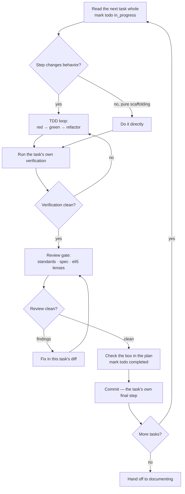

# Build phase

**The build phase takes an approved plan and turns it into code — working the tasks in order, in an isolated workspace, driving every behavior change test-first and letting no task be marked done until an automated review of its diff comes back clean.**

---

## 🌟 Overview (plain-language)

Build is the phase that actually writes the code. By the time it runs, the earlier phases have already done the deciding: a spec was approved, then a **plan** broke that spec into an ordered list of bite-sized tasks with the test integration points marked. Build does none of that thinking again. Its one job is to execute the plan faithfully — task by task, in the plan's order — and to hold two guarantees on every task that changes behavior: a test existed *before* the code, and an automated review passed *before* the box was checked.

It is also the last stop that a human is expected to have gated. The **plan-approval gate** just upstream is the final checkpoint; once build confirms that gate cleared, it runs to completion with no further human stops. So the discipline it enforces on itself is the only thing standing between the approved plan and a finished branch.

Everything build does happens inside an **isolated workspace** — its own worktree, or its own feature branch, cut off whatever branch was checked out. This is the one place in the pipeline where work first lands on a branch; the entrances, the design dialogue, spec, and plan all ran on the current branch and wrote only gitignored `.engineering/` scratch. Which kind of isolation was settled back at the plan gate and recorded in the plan's Global Constraints.

**Worked example — one task through the loop.** Say the plan's third task is *"reject a withdrawal that exceeds the balance."* Build reads the task whole first: its Files block, any Interfaces block, and every numbered step, so a later step can't contradict a constraint an earlier one set. The task has one behavior-changing step, so build drops into the **TDD loop**: it writes `test_withdrawal_rejected_when_balance_insufficient`, runs it, and *watches it fail* for the right reason — the assertion, not a typo. Then it writes the smallest code that turns the test green, and refactors with the suite green in front of it. It runs the task's own named verification command and confirms the output the task says counts as passing. Then it gates the task's diff through the **review protocol** — three lenses, described below. The review comes back clean, so build flips that task's `- [ ]` to `- [x]` in the plan file, marks the matching todo `completed`, and runs the exact `git commit` the task's own final step specifies. Only then does it move to task four.

That per-task cycle is the spine of the whole phase:



When the plan builds as a **stack** — its Global Constraints carry `PR strategy: stacked`, which the pipeline uses for all work — the loop runs the same way, one task at a time, but each task carries two extra steps the plan author already wrote: one at the top that starts the task's branch off the previous task's branch, and one at the bottom that opens and submits that task's own pull request. The stack is linear, so the tasks cannot fan out to parallel agents; build runs them strictly in sequence.

Once the last box is checked, build reports the plan's path and its final commit and hands off — first to **documenting** (which writes or updates the feature's docs on the green branch), which in turn hands to **finish** (which opens the pull request the plan gate already authorized). Build never decides *how* the branch integrates; it only reaches the phase that does.

## 🛠 Technical reference

The phase is one skill plus a set of references it loads at the moments the loop reaches them.

| Area | Unit | Responsibility |
|---|---|---|
| Phase orchestrator | `skills/build/SKILL.md` | Finds and confirms the approved plan, seeds the todo list, runs the per-task loop in order, applies the stacked-PR steps, and hands off to documenting. Owns no TDD or review logic of its own — it loads the references below. |
| Workspace | `skills/build/references/establishing-workspace.md` | Moves the work into isolation before any file changes: detects isolation that already exists and joins it, else creates the recorded kind (worktree — migrating `.engineering/` across — or feature branch), runs project setup, and records a clean pre-build baseline. |
| TDD loop | `skills/build/references/tdd-loop.md` | Drives each behavior-changing step through strict red-green-refactor: a test written and *watched to fail* for the right reason, then the smallest code that passes it, then a refactor against a green suite. One behavior per cycle. |
| Test design | `skills/build/references/tests.md` | How to shape the test the loop writes: one behavior per test, arrange-act-assert, naming for the behavior and condition, independence from other tests' state. |
| Mocking | `skills/build/references/mocking.md` | When a stand-in makes a test more honest and when it makes it lie: mock only boundaries you own, prefer the real collaborator, never mock the thing under test. |
| Review orchestrator | `skills/build/references/review-protocol.md` | Gates a task's diff: fans out one sub-reviewer per lens in parallel (or applies all three inline below the small-diff floor), then reconciles into one report grouped by lens, dropping none. Reports findings; does not fix them. |
| Review lenses | `skills/build/references/lenses/standards.md`, `lenses/spec.md`, `lenses/eli5.md` | The three independent judgements a diff is reviewed through — one lens per sub-reviewer, each reviewing its own axis and handing any cross-lens observation across rather than folding it in. |

**The three review lenses.** Each task's diff is judged through exactly these, kept separate in the report so a reader trusting the Standards findings knows nothing about scope or docblocks is hiding among them:

| Lens | Reference | What it judges | What it is not |
|---|---|---|---|
| **Standards** | `lenses/standards.md` | Is the code good on its own terms — correct, clear to the next reader, carrying tests that would catch a regression, free of recurring security mistakes, following the conventions already around it. | Scope (that's Spec), docblock prose (that's ELI5), or taste with no consequence. |
| **Spec** | `lenses/spec.md` | Does the change do what was actually asked, measured against the approved spec in `.engineering/<run>/spec/` if one exists, or the stated request if not. Reports Standards-only on its axis when nothing is filed, rather than inventing a spec. | Code quality dressed as scope; the reviewer's own opinion of what the spec *should* have said. |
| **ELI5** | `lenses/eli5.md` | Could a reader outside the team follow the **docblocks** — it flags prose that fails to explain its symbol and public symbols missing a docblock. It flags; it never rewrites, and never touches structured tags (`@param`, `@return`, `@throws`). | The code itself; structured tags; prose that already does its job (when in doubt, leave it). |

**Boundaries & invariants.**

- **No box checked without test-first and a clean review.** A task changing behavior is marked done only after a test existed before its code (watched to fail) *and* its diff passed all three review lenses. A review with findings is addressed in the diff and re-reviewed on the corrected diff before the box flips.
- **The plan file is the source of truth for progress.** The box is checked in the plan itself and the matching todo marked `completed` in the same breath, so the two records never disagree; a resumed run rebuilds its todo list from the plan's checked and unchecked tasks.
- **Build does not write or decide the plan.** The tasks and their order were settled during planning; build executes what is on the page and never adds, removes, or reorders a task. It refuses to run at all without the `.engineering/<run>/plan/APPROVED.md` marker — the last human-approval gate.
- **Build does not decide the plan is finished early.** A plan is done when its last task is checked, not when the code looks complete or the user seems satisfied partway through.
- **No gap is punted to "later."** A gap a task turns up — a review finding, a missing case, a follow-up the change plainly needs — is closed in that task's diff or surfaced as an explicit decision a human can see. It is never left as a `TODO`, a "next steps" note, or a hand-off nobody tracks (see `engineering:refusing-deferral`).
- **Stacked plans run sequentially.** The stack is linear, so tasks run one at a time in the plan's order — there is no parallel subagent mode for a stacked build. Each task's branch-open step runs before its commit steps, so commits land on that task's own branch.

## 🚀 Development & testing

The plugin is skills and shell tests, so build's "tests" are structural assertions over the skill and its references — that the review lenses exist and keep their rules, that the forward seams don't park, that the stacked-PR prose stays intact. Run the full foundation suite, or the checks that touch the build phase directly:

```bash
# Run the full foundation suite (what CI runs)
sh engineering/tests/suite.sh

# Checks that touch the build phase directly
sh engineering/tests/validate.sh        # review-protocol + the three lens references and their rules
sh engineering/tests/stacked-prs.sh     # the stacked-PR steps build runs, and that "merge" prose stays out
sh engineering/tests/acceptance.sh      # end-to-end checklist, incl. build's hand-off to finish
```

To change how a behavior gets built, edit `skills/build/references/tdd-loop.md` (the red-green-refactor cycle), `tests.md` (test shape), or `mocking.md` (stand-ins). To change how a task's diff is gated, edit `skills/build/references/review-protocol.md` (the orchestrator) or the lens docs under `skills/build/references/lenses/`. To change how the workspace is established, edit `skills/build/references/establishing-workspace.md`.
