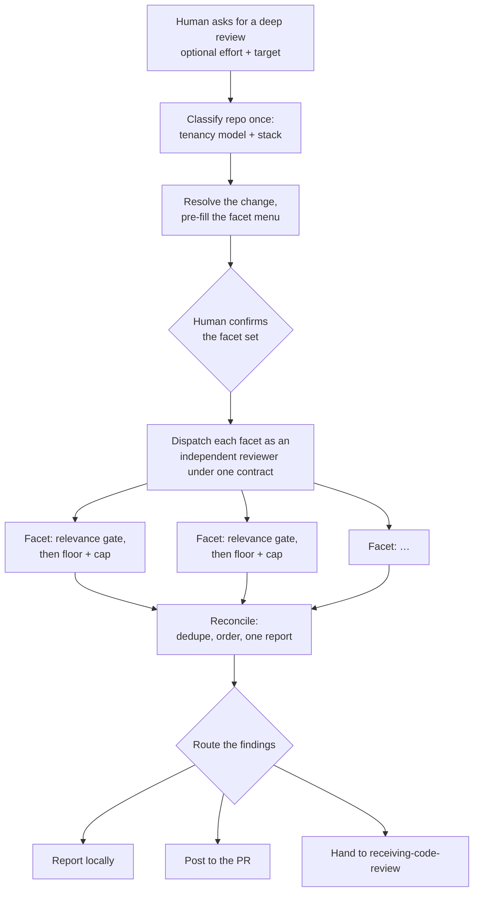

# Code review

**The deep, opt-in review a person reaches for on a higher-risk change: they pick which review lenses to run, each runs as its own self-limiting reviewer, and their findings are reconciled into one report and routed where the human chooses — it never edits the code.**

---

## 🌟 Overview (plain-language)

Most of what the pipeline reviews, it reviews on its own. `build` runs a review gate after each task, and `finish` reads the whole branch before opening a PR. **Code review** is neither of those. It is the heavier pass a person runs deliberately, when a change is worth a closer look than the automated gates give it — a security-sensitive change, a risky migration, anything headed for merge that someone wants read hard first. Nothing triggers it automatically; a human decides a change earns it and asks for it.

The unit of the review is a **facet** — one review lens, such as security, concurrency, or the frontend surface. Rather than run every lens on every change, code review offers a **menu** of facets and lets the human pick. The menu arrives **pre-filled**: a set of core lenses is always checked, and others are pre-checked when the change's character matches them, so the human is confirming a sensible default rather than choosing from a blank slate. They uncheck what they don't want and add what they do.

Each selected facet is **dispatched** as an independent reviewer working from a shared **facet contract** — the same request in, the same result shape out — so the orchestrator knows nothing facet-specific and every facet obeys the same **hard stops**: it decides first whether the change even warrants it (and skips cheaply if not), reports at most a capped number of findings most-severe-first, and drops anything below a confidence/severity floor. Effort is one dial that sets those caps for every facet at once. When the facets return, the orchestrator **reconciles** them — dedupes overlapping hits, orders everything, and produces one report — then puts the report's fate to the human: keep it local, post it to the PR, or hand it into the fix pipeline.

**Worked example.** A developer has a branch that adds a bulk account-merge operation and wants it reviewed before it ships. They ask for a deep review, pointing it at the branch and setting effort `high`. Code review first classifies the repo once: it reads the persistence layer, sees a `tenant_id` discriminator across tables, and returns a `shared` tenancy verdict; it reads `composer.json` and `package.json` and returns a stack set of `laravel`. It resolves the branch as the change to review, then pre-fills the menu — the eight core facets, plus `reviewing-data-safety` (the change performs a bulk update) and `reviewing-idempotency` (a replayable side effect), plus the shared-DB tenant-isolation facet and framework-best-practices facet the repo classification proposed. The human confirms, unchecks frontend, and runs it. The facets fan out in parallel; each writes its own `findings.md` under `.engineering/<run>/`. Security finds a missing server-side authorization check and reports that three more findings wait behind its cap; the tenant-isolation facet finds a merge query that lost its tenant scope; test-quality skips itself because the change ships no test surface it can judge. The orchestrator reconciles the results into one ordered report, and the developer picks **Post to the PR**, so each finding lands as a review comment on the line it references. Code review changes none of the code — the developer does that next.



## 🛠 Technical reference

The detail a reader who will change code review needs. Everything lives under `skills/code-review/`.

**Architecture.**

| Area | Unit | Responsibility |
|---|---|---|
| Orchestrator | `skills/code-review/SKILL.md` | Parses effort/target, classifies tenancy and stack, resolves the change, pre-fills and confirms the menu, fans out the selected facets, reconciles their results into one report, and routes it. Report-only: never edits code. |
| Contract | `skills/code-review/references/facet-contract.md` | The uniform request/result/finding interface between the orchestrator and every facet, so the orchestrator holds no facet-specific knowledge and a new facet is "implement this contract + add a menu row." |
| Hard stops | `skills/code-review/references/hard-stops.md` | The three self-limits every facet enforces at the source: relevance gate first, top-N severity cap (with a `dropped` count), confidence/severity floor. No numeric token ceiling. |
| Facets | `skills/code-review/references/facets/<facet>/facet.md` | One review lens each (17 today; some facets carry more than one sub-lens under one relevance gate). A facet's own doc is read only when it is dispatched — never merely to decide whether to run it. |
| Tenancy signals | `skills/code-review/references/multi-tenancy-signals.md` | Reasoned (not scripted) classification of the repo's tenancy model into one verdict — `shared`, `per-db`, `both`, `none`, or `ambiguous` — that decides which tenant-isolation facets the menu proposes. |
| Stack signals | `skills/code-review/references/stack-signals.md` | Reasoned classification of the repo's frameworks into a *set* (stacks aren't mutually exclusive), deciding whether `reviewing-framework-best-practices` is proposed. |

**The facets.** Each is one lens. **Core** facets are always pre-checked. **Core-when-present** facets are pre-checked when the repo classification proposes them. **Opt-in** facets are pre-checked when the change's character — *what the change does*, never its file paths — matches.

| Facet | Lens | Pre-check group |
|---|---|---|
| `reviewing-security` | OWASP-class defects; authorization enforced, not assumed | Core (always) |
| `reviewing-novelty` | Reuse over reinvention of what a framework/library/module already provides | Core (always) |
| `reviewing-technical` | Inefficient data access (N+1, unbounded queries); correctness-scoped best practice | Core (always) |
| `reviewing-architectural` | Coupling, dependency direction, cohesion, leaky abstractions | Core (always) |
| `reviewing-error-handling` | Silent failures, swallowed exceptions, bad fallbacks | Core (always) |
| `reviewing-test-quality` | Do tests exercise the change and fail if it breaks? | Core (always) |
| `reviewing-concurrency` | Races and unsafe interleaving: check-then-act, non-atomic read-modify-write, missing lock/transaction | Core (always) |
| `reviewing-numeric-precision` | Precision/unit defects: float for money, silent rounding, unit mismatch, overflow, lossy cast | Core (always) |
| `reviewing-tenant-isolation-shared-db` | Cross-tenant leaks in a single-DB/shared-schema app | Core-when-present (`shared`/`both` verdict) |
| `reviewing-tenant-isolation-isolated-db` | Cross-tenant leaks in a database-per-tenant app | Core-when-present (`per-db`/`both` verdict) |
| `reviewing-framework-best-practices` | Stack-specific idiom violations (Laravel, Tailwind today) | Core-when-present (non-empty stack set) |
| `reviewing-data-safety` | Destructive/irreversible ops, migrations, data loss | Opt-in: alters stored-data structure or does a destructive/irreversible op |
| `reviewing-api-compat` | Breaking changes to public contracts | Opt-in: alters a public contract others consume |
| `reviewing-idempotency` | Side effects unsafe to run twice | Opt-in: performs a side effect that may run more than once with no dedup guard |
| `reviewing-api-consumption` | Remote/HTTP API consumption: over-fetch, client-side filtering, call volume, 429 safety | Opt-in: consumes a remote/HTTP API it does not own |
| `reviewing-frontend` | Frontend surface across three lenses: Accessibility (perceivability & operability), Data presentation (identity ambiguity), Internationalization (translatability) | Opt-in: alters a user-facing surface — rendered output, record labeling/identity, or localized text |
| `reviewing-electron` | Electron process-model & security hardening plus best practices | Opt-in: touches an Electron process-model or security surface |

**Effort.** One argument, `low`/`medium`/`high`/`max` (default `medium`), sets the `caps` handed to every facet — `top_n` (2/3/5/8) and `floor` (`high`/`med`/`low`/`low`). Lower effort returns fewer, higher-confidence findings; higher effort widens coverage. Effort tunes only the caps; it never changes which facets are selected.

**Target.** An optional pointer to what to review — a PR/MR link or number, a branch, a diff, or a path — resolved into `change_ref`. Omitted, it falls back to the working diff / current branch. A PR/MR target is also what makes the **Post to the PR** route available.

**Boundaries & invariants.**
- **Opt-in and human-triggered — not a pipeline gate.** Nothing runs code review automatically; a person invokes it. It is distinct from `build`'s per-task review gate (automated, runs after every task) and from `finish`'s whole-branch read before a PR. A clean report is information a human uses, not a switch this skill throws.
- **One contract, one set of hard stops.** Every facet obeys the same request/result shape and the same three self-limits, enforced inside the facet at the source — the orchestrator does not trim findings afterward. Adding a facet is implementing the contract and adding a menu row.
- **Two gates, not one.** A repo-level menu-proposal gate (tenancy + stack) decides which facets *appear*; each facet's own per-change relevance gate decides whether it *runs*. Proposing is not running — a proposed facet still self-skips on a change that touches nothing it covers.
- **Never fewer than the floor.** Core and repo-proposed core-when-present facets are always pre-checked; auto-assignment only *adds* matched opt-in facets. A run is never pre-filled with fewer facets than it would have had before auto-assignment.
- **Routes findings, doesn't fix.** Code review is report-only even when the findings travel onward — posting to the PR or handing to `receiving-code-review` shapes the findings for a downstream that applies them; code review itself never edits code. The route is the human's pick, not the skill's.
- **Durable per-facet record.** Every facet writes a `findings.md` under `.engineering/<run>/<facet>/`, including on a clean or skipped run, so the reconciled report is backed by an auditable trail.

## 🚀 Development & testing

Code review is skill docs and shell tests, so its tests are structural assertions over the skill files. Run the full foundation suite, which is what CI runs:

```bash
sh engineering/tests/suite.sh
```

The code-review orchestrator's own assertions live in `engineering/tests/validate.sh` (the `code-review:` block): the skill exists and names itself, derives its run directory via `run-context.sh`, writes under `.engineering/<run>/`, leaves no `.guardtower` path behind, wires all three routes (report locally, post to the PR, hand to `receiving-code-review`), states it never edits code, and names no harness-specific question tool. Run it alone with:

```bash
sh engineering/tests/validate.sh
```

Related suites in the same pipeline: `engineering/tests/code-review-entrance.sh` covers the separate `receiving-code-review` entrance (the fix pipeline this skill can hand off to), and `engineering/tests/frontmatter.sh` checks every skill's frontmatter, code review included.

To change how a facet reviews, edit its `skills/code-review/references/facets/<facet>/facet.md`. To change the shared discipline all facets share, edit `references/facet-contract.md` (the interface) or `references/hard-stops.md` (the self-limits) — keep the self-enforcement shape: a cap the orchestrator applies after a facet has already done unbounded work saves output, not work. To change which facets the menu proposes for a repo, edit `references/multi-tenancy-signals.md` or `references/stack-signals.md`.
