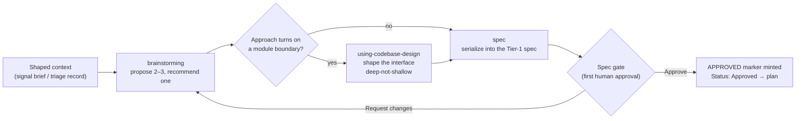

# Design phase

**The design phase is the shared dialogue that turns a shaped brief into an approved spec: it weighs
two or three real approaches, recommends one, shapes any module boundary that approach turns on, and
then holds the pipeline's first human-approval gate before a single line is planned or built.**

---

## 🌟 Overview (plain-language)

Once an entrance has done its interrogation — `signal` has turned a request into a brief, or
`triage` has isolated a defect — the work arrives at design with a problem worth solving but no
decision yet about *how*. The design phase is where that decision gets made, out loud, with a human
in the loop. It runs in three moves that flow into one another: **brainstorming** proposes and
recommends an approach, **using-codebase-design** shapes any interface that approach leans on, and
**spec** writes the decision down and gates it.

**Brainstorming** is the dialogue. It starts by reading context — but it consults the project's
feature docs before it greps. Where a `docs/` tree with a `docs/toc.md` index exists (what the
`documenting` phase produces), brainstorming reads the index first, follows it to the feature docs
this work touches, and uses their named modules and boundaries to aim its reading of the actual
code — a narrow read instead of a grep that sprawls the whole tree. The docs it consulted get
recorded, because the spec will cite them. Then it puts **2–3 genuinely different approaches** on the
table, each with its real trade-offs — what it costs to build, what it costs to live with, what it
makes harder later — and recommends one, marked `(Recommended)`, as a structured choice the human
selects from rather than a wall of prose. One approach becomes one design, one spec, one plan; a
problem too big for a single pass is broken into ordered **increments** *inside* that one design, never
scattered across several.

Some approaches are settled the moment one is picked. Others turn on a **module boundary** — a new
interface, or an existing seam the approach reshapes — where the load-bearing question is not *which*
approach but *what the interface looks like*. For that second kind, brainstorming invokes
**using-codebase-design** on the boundary, here, before the spec. That skill shapes the interface
**deep, not shallow**: a narrow, simple interface sitting in front of a large amount of work, judged
by what it costs a caller to learn against how much the module does once asked. It sketches at least
two competing shapes (**design-it-twice**), runs them through the SOLID lenses and anti-pattern
table, proposes a named pattern *only* when its trigger genuinely fires, and — when the boundary
touches tenant-scoped data in a multi-tenant app — forces a **tenancy** decision (where isolation
lives) as a required part of the shape. The chosen shape travels with the design into the spec's §6.

The reason boundaries are shaped *here* and not later is the gate. The **spec gate** is the
pipeline's first human approval, and an interface is usually the highest-leverage decision in a
design; deferring it past the gate would mean the human approved an approach whose real shape was
still open.



Once the design is recommended and any boundary shaped, brainstorming hands off to **spec** — it does
not write the spec itself. Spec is the single writer of the Tier-1 spec format. It renders the
recommended design into one document (§0 ELI5 through §8 Open questions), writes it as a **draft**,
presents it, and puts the verdict to the human as a structured choice: `Approve` or `Request
changes`. Nothing is `Approved` and no marker is written until the human picks Approve; their edits
come back as a revision, or hand back to brainstorming for a rethink. On approval — and only then —
spec mints the run-scoped **approval marker** at `.engineering/<run>/to-spec/APPROVED.md` and flips
the status line to `Approved`. That marker *is* the approval; `plan` reads it as its precondition and
refuses an `Approved` status with no marker behind it.

**Worked example.** A signal brief lands asking for per-customer export limits. Brainstorming reads
`docs/toc.md`, follows it to the exports feature doc, and reads the throttling module the doc names —
targeted, not a blind sweep. It puts up three approaches: a hard-coded ceiling, a config-file limit,
and a per-tenant limit resolved at request time; it recommends the third, because the brief's users
are on different plans, and marks the trade-off that it needs a new limit-resolution boundary. That
recommendation turns on a boundary, so brainstorming invokes using-codebase-design on it: the app is
shared-database, so the tenancy companion forces the limit query to be scoped where no caller can
build an unscoped one, and design-it-twice picks a deep `resolveLimit(tenant)` over a shallow
pass-the-discriminator shape. The shaped boundary and the two rejected approaches travel into spec's
§6; the exports doc is cited in §7. Spec writes the draft, presents it, the human clicks `Approve`,
the `APPROVED.md` marker is minted, the status flips, and `plan` takes it from there.

## 🛠 Technical reference

The phase is three skills and their references, split across the dialogue, the boundary work, and the
writer that holds the gate.

| Area | Unit | Responsibility |
|---|---|---|
| Dialogue | `skills/brainstorming/SKILL.md` | Explores context, proposes 2–3 approaches with trade-offs, recommends one as a structured choice, invokes boundary-shaping when the approach turns on a seam, then hands off. Does **not** write the spec, design interface internals, or interrogate requirements. |
| Doc consult | `skills/brainstorming/references/consulting-documentation.md` | Drives the Explore-context step to read `docs/toc.md` before greps, target code reading with what it finds, and record the docs consulted so the spec's §7 cites them. Docs are a guide; the code is the truth. |
| Boundary shaping | `skills/using-codebase-design/SKILL.md` | Shapes one module interface deep-not-shallow from two competing sketches (design mode), or judges one supplied shape against the same lenses (argument `review`). Shapes the boundary in front of it; does not audit the codebase, decide what to build, or implement. |
| Depth & leakage | `skills/using-codebase-design/references/DEEPENING.md`, `SHAPE-REVIEW.md`, `PATTERN-MATRIX.md`, `DESIGN-IT-TWICE.md` | The mechanics: concrete deepening moves, the SOLID + anti-pattern evaluative lens, the 23-pattern selectable matrix (proposed only when a trigger fires), and how to generate a genuinely different second design and choose between the two. |
| Tenancy | `skills/using-codebase-design/references/TENANCY-SHARED-DB.md`, `TENANCY-ISOLATED-DB.md` | The model-specific isolation decision, forced as a required part of any boundary touching tenant-scoped data in a multi-tenant app — the shared-DB query-scope companion or the isolated-DB connection companion, whichever matches the stated model. |
| Spec writer & gate | `skills/spec/SKILL.md` | The single writer of the Tier-1 spec and holder of the spec gate. Serializes the recommended design into one spec, writes it as a draft, holds for the human's `Approve`/`Request changes`, and on approval mints the marker and promotes. Does not design, plan, interrogate, or invent. |
| Spec shape | `skills/spec/references/SPEC-FORMAT.md` | The one spec format, §0 ELI5 through §8 Open questions: §6 Approach transcribes the design dialogue's outcome, §7 Existing context cites the consulted docs. Rendered per the shared consumable-markdown conventions. |

**Conventions.** The spec renders per one shared style reference,
`engineering/references/consumable-markdown.md` — a top-line hook, progressive disclosure, bold key
terms on first use, tables for enumerable content, diagrams at the point of introduction, and worked
examples — the same conventions this document follows.

**Boundaries & invariants.**
- **The dialogue does not write the spec.** Brainstorming produces a *recommended design* and hands
  it off; serializing it into the spec is `spec`'s job, invoked after the dialogue ends. Brainstorming
  never writes into `.engineering/<run>/spec/`.
- **Spec is the only writer of the spec dir.** `spec` is the single skill permitted to write
  `.engineering/<run>/spec/`, and it writes exactly one Tier-1 spec, in one format, at one path per run.
- **The spec gate is the first human gate.** The design dialogue holds no gate and mints no marker;
  the spec gate — held by `spec` — is the pipeline's first human approval. This is why a load-bearing
  boundary is shaped before the gate, not after.
- **Approval is a marker, not a checkbox.** Nothing is `Approved` until the human picks Approve and
  `spec` mints `.engineering/<run>/to-spec/APPROVED.md`. The marker's existence *is* the approval;
  `plan` refuses an `Approved` status with no marker behind it, so the two are only ever promoted
  together, at the moment of approval.
- **One design, one spec, one plan.** A problem too large for one pass is broken into ordered
  increments inside the single spec's §6, never split across multiple specs or plans. A small,
  well-pinned change may skip *writing* a spec via an explicit opt-in (a `SPEC-SKIPPED.md` marker) —
  a routing choice, not an approval; the plan gate downstream still holds unchanged.

## 🚀 Development & testing

The phase is skills and references, so its tests are structural shell assertions over the skill files
and their markers:

```bash
# Run the full foundation suite (what CI runs)
sh engineering/tests/suite.sh

# The checks that bear on the design phase
sh engineering/tests/consulting-docs.sh        # brainstorming reads docs/toc.md before greps + spec §7 citation
sh engineering/tests/absorb-approval-gate.sh   # the spec gate is a human gate; the design dialogue holds none
sh engineering/tests/consumable-markdown.sh    # the shared style reference the spec renders under
sh engineering/tests/frontmatter.sh            # every skill's frontmatter (global check; covers the three design skills among them)
```

To change how the dialogue behaves, edit `skills/brainstorming/SKILL.md` (approach proposal, hand-off,
right-sizing) or its `references/consulting-documentation.md` (the doc-consult order). To change how a
boundary is shaped, edit `skills/using-codebase-design/SKILL.md` or its references under
`skills/using-codebase-design/references/` (deepening moves, the SOLID/anti-pattern lens, the pattern
matrix, design-it-twice, the two tenancy companions). To change the spec's shape or the gate, edit
`skills/spec/SKILL.md` (the gate mechanics) and `skills/spec/references/SPEC-FORMAT.md` (the spec
sections).
