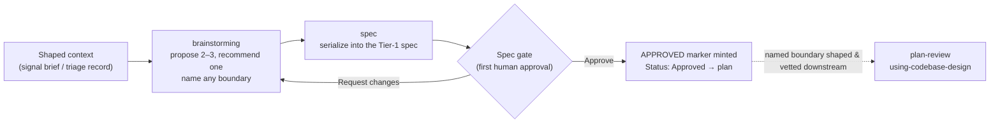

# Design phase

**The design phase is the shared dialogue that turns a shaped brief into an approved spec: it weighs
two or three real approaches, recommends one, names any module boundary that approach turns on, and
then holds the pipeline's first human-approval gate before a single line is planned or built.**

---

## 🌟 Overview (plain-language)

Once an entrance has done its interrogation — `signal` has turned a request into a brief, or
`triage` has isolated a defect — the work arrives at design with a problem worth solving but no
decision yet about *how*. The design phase is where that decision gets made, out loud, with a human
in the loop. It runs in two moves that flow into one another: **brainstorming** proposes and
recommends an approach, and **spec** writes the decision down and gates it.

**Brainstorming** is the dialogue. It starts by reading context — the files the work will touch,
any docs sitting near them, and recent commits in the area — so the approach extends how the
neighborhood already does things instead of fighting it. Then it puts **2–3 genuinely different
approaches** on the table, each with its real trade-offs — what it costs to build, what it costs to
live with, what it makes harder later — and recommends one, marked `(Recommended)`, as a structured
choice the human selects from rather than a wall of prose. One approach becomes one design, one
spec, one plan; a problem too big for a single pass is broken into ordered **increments** *inside*
that one design, never scattered across several.

Some approaches turn on a **module boundary** — a new seam, or an existing one the approach moves.
When that's the substance of the approach, brainstorming **names** it: where the seam sits, what
falls on each side, and why. What it does **not** do is shape that boundary's interface or pick the
pattern that fits it. That restraint is the thing this phase turns on. At design time you have
skimmed context but built nothing, so "what a caller must know" is a guess, and a pattern chosen
before you can see the shape it applies to is cargo-culting. Interface shape and pattern fit are
judged later, at **plan-review**, where the plan's task sketches give `using-codebase-design`
concrete code to weigh — and where a tenant-scoped boundary's isolation decision is forced as a
must-fix. The named-but-unshaped boundary travels into the spec's §6 and on to the plan.

So the spec gate approves an *approach* — the decision that is genuinely the human's to make — not
an interface signature, which is an implementation detail the plan settles and plan-review vets.



Once the design is recommended and any boundary named, brainstorming hands off to **spec** — it does
not write the spec itself. Spec is the single writer of the Tier-1 spec format. It renders the
recommended design into one document (§0 ELI5 through §8 Open questions), writes it as a **draft**,
presents it, and puts the verdict to the human as a structured choice: `Approve` or `Request
changes`. Nothing is `Approved` and no marker is written until the human picks Approve; their edits
come back as a revision, or hand back to brainstorming for a rethink. On approval — and only then —
spec mints the run-scoped **approval marker** at `.engineering/<run>/to-spec/APPROVED.md` and flips
the status line to `Approved`. That marker *is* the approval; `plan` reads it as its precondition and
refuses an `Approved` status with no marker behind it.

**Worked example.** A signal brief lands asking for per-customer export limits. Brainstorming reads
`docs/toc.md`, follows it to the exports feature doc, and reads the throttling module the doc names —
targeted, not a blind sweep. It puts up three approaches: a hard-coded ceiling, a config-file limit,
and a per-tenant limit resolved at request time; it recommends the third, because the brief's users
are on different plans, and marks that it introduces a new limit-resolution boundary between the
export path and tenant configuration. Brainstorming **names** that boundary — a seam where the export
path asks for a tenant's limit — but stops there: it does not settle whether that's
`resolveLimit(tenant)` or some other shape, because there is no concrete code yet to judge against.
The named boundary and the two rejected approaches travel into spec's §6; the exports doc is cited in
§7. Spec writes the draft, presents it, the human clicks `Approve`, the `APPROVED.md` marker is
minted, the status flips, and `plan` takes it from there — sketching the interface, and at
plan-review running it through `using-codebase-design`, which picks the deep `resolveLimit(tenant)`
shape over a shallow pass-the-discriminator one and, because the app is shared-database, forces the
limit query to be tenant-scoped where no caller can build an unscoped one.

## 🛠 Technical reference

The phase is two skills and their references: the dialogue that recommends, and the writer that holds
the gate. Boundary *shaping* itself lives downstream, in plan-review's `using-codebase-design`; this
phase only *names* the boundary an approach turns on.

| Area | Unit | Responsibility |
|---|---|---|
| Dialogue | `skills/brainstorming/SKILL.md` | Explores context, proposes 2–3 approaches with trade-offs, recommends one as a structured choice, names any boundary the approach turns on, then hands off. Does **not** write the spec, shape interfaces, or interrogate requirements. |
| Spec writer & gate | `skills/spec/SKILL.md` | The single writer of the Tier-1 spec and holder of the spec gate. Serializes the recommended design into one spec, writes it as a draft, holds for the human's `Approve`/`Request changes`, and on approval mints the marker and promotes. Does not design, plan, interrogate, or invent. |
| Spec shape | `skills/spec/references/templates/markdown/spec.md` | The one spec format and format contract, §0 ELI5 through §8 Open questions: §6 Approach transcribes the design dialogue's outcome (including any boundary named), §7 Existing context cites the consulted docs. Rendered per the shared consumable-markdown conventions. |

Interface shaping and its references — depth and leakage, the SOLID/anti-pattern lens, the pattern
matrix, design-it-twice, and the two tenancy companions — live with `skills/using-codebase-design/`
and are invoked at **plan-review**, over concrete task sketches, not here. See
`docs/pipeline/planning/README.md`.

**Conventions.** The spec renders per one shared style reference,
`engineering/references/consumable-markdown.md` — a top-line hook, progressive disclosure, bold key
terms on first use, tables for enumerable content, diagrams at the point of introduction, and worked
examples — the same conventions this document follows.

**Boundaries & invariants.**
- **The dialogue does not write the spec.** Brainstorming produces a *recommended design* and hands
  it off; serializing it into the spec is `spec`'s job, invoked after the dialogue ends. Brainstorming
  never writes into `.engineering/<run>/spec/`.
- **Spec is the only writer of the spec dir.** `spec` is the single skill permitted to write
  `.engineering/<run>/spec/`, and it writes exactly one Tier-1 spec, in one format, at one path per run.
- **A boundary is named here, shaped later.** Brainstorming names a boundary the approach turns on;
  it does not shape its interface or choose a pattern. That judgment needs concrete code and lands at
  plan-review (`using-codebase-design` in review mode), where a tenant-scoped boundary's isolation
  decision is also forced as a must-fix. Design-time decisions are kept to the ones a human can
  actually make without an implementation in front of them.
- **The spec gate is the first human gate.** The design dialogue holds no gate and mints no marker;
  the spec gate — held by `spec` — is the pipeline's first human approval. The human approves an
  *approach*, with any boundary it turns on *named*; the interface's shape is settled and vetted
  downstream, not at this gate.
- **Approval is a marker, not a checkbox.** Nothing is `Approved` until the human picks Approve and
  `spec` mints `.engineering/<run>/to-spec/APPROVED.md`. The marker's existence *is* the approval;
  `plan` refuses an `Approved` status with no marker behind it, so the two are only ever promoted
  together, at the moment of approval.
- **One design, one spec, one plan.** A problem too large for one pass is broken into ordered
  increments inside the single spec's §6, never split across multiple specs or plans. A small,
  well-pinned change may skip *writing* a spec via an explicit opt-in (a `SPEC-SKIPPED.md` marker) —
  a routing choice, not an approval; the plan gate downstream still holds unchanged.

## 🚀 Development & testing

The phase is skills and references, so its tests are structural shell assertions over the skill files
and their markers:

```bash
# Run the full foundation suite (what CI runs)
sh engineering/tests/suite.sh

# The checks that bear on the design phase
sh engineering/tests/absorb-approval-gate.sh   # the spec gate is a human gate; the design dialogue holds none
sh engineering/tests/consumable-markdown.sh    # the shared style reference the spec renders under
sh engineering/tests/frontmatter.sh            # every skill's frontmatter (global check; covers the design skills among them)
```

To change how the dialogue behaves, edit `skills/brainstorming/SKILL.md` (approach proposal, boundary
naming, hand-off, right-sizing). To change how a boundary is *shaped* — which now happens at
plan-review — edit `skills/using-codebase-design/SKILL.md` or its references under
`skills/using-codebase-design/references/` (deepening moves, the SOLID/anti-pattern lens, the pattern
matrix, design-it-twice, the two tenancy companions). To change the spec's shape or the gate, edit
`skills/spec/SKILL.md` (the gate mechanics) and `skills/spec/references/templates/markdown/spec.md`
(the spec sections).
