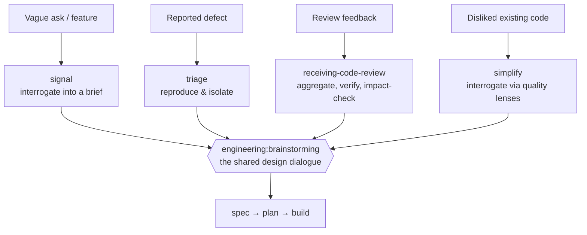

# Pipeline entrances

**The four doors work enters the pipeline through — `signal` for a vague ask, `triage` for a
reported defect, `receiving-code-review` for review feedback, `simplify` for existing code you
dislike — each of which shapes raw context into something designable and hands it to the same
design dialogue.**

---

## 🌟 Overview (plain-language)

Work does not arrive at the pipeline ready to design. A feature request is a sentence someone typed
in a hurry; a bug report is a symptom and a guess at its cause; a batch of review comments is a pile
of claims, some right and some not. An **entrance** is the skill that takes one of those raw inputs
and does the work of turning it into context a designer can act on — then gets out of the way. There
are exactly four, one per kind of input, and they share a spine: **establish a run**, **shape
context**, **hand to the design dialogue**. Only the middle beat differs, and that difference is the
whole reason there are four.

- **`signal`** is the discovery door. A vague or open-ended ask enters here, and signal
  **interrogates** it into a **brief** before anyone designs against it.
- **`triage`** is the defect door. A bug report enters here, and triage **reproduces** the failure
  under its own control and **isolates** it to a domain concept before anyone designs a fix.
- **`receiving-code-review`** is the review-feedback door. A set of review comments enters here, and
  the entrance **aggregates**, **verifies**, and **impact-checks** them before anyone designs the
  changes. Aggregation stays on the main thread — the comments interrelate and must be read as one
  set — but the per-comment verify and impact-check follow an inline-vs-fan-out floor: a small
  reception, roughly three or fewer comments, is checked inline, while a larger one fans each comment
  (or a tight cluster) out to a subagent that shares only a read of the review branch, then
  reconciles the verdicts. Reply and resolve stay on the main thread.
- **`simplify`** is the refactor door. Existing code the developer dislikes enters here, and the
  entrance **interrogates** the perceived problem through a fixed set of **language-neutral quality
  lenses**, turning each dislike into a **named target quality paired with an observable check**
  before anyone proposes a refactor. It is distinct from the base `simplify` skill (which reviews
  the current diff and applies cleanups); this entrance shapes context and changes no code.

**Worked example.** Someone drops in: *"Admins keep asking for a way to pull the audit log out of the
system — can we add an export?"* That is a vague feature ask, so it goes to `signal`. Signal's first
move is not to sketch an export button. It runs `run-context.sh` to get a scratch directory
(`.engineering/<run>/signal/`), writes the request verbatim into `00-request.md`, then invokes the
shared interrogation skill and starts asking one pointed question at a time — each posed as a
short menu with a recommended default and an open escape. *Export to what: CSV (recommended), JSON, a
scheduled email?* *Who signs off?* *What is explicitly out of scope — filtering, date ranges,
redaction of PII?* The user picks and corrects; the corrections are where the real requirements hide.
Once the gate is met — at least three rounds, and all six coverage dimensions filled — signal writes
`brief.md` §1–§6 (Problem, Users & Stakeholders, Success Criteria, Constraints, Scope, Existing
Context) to disk, and hands that brief's path to `engineering:brainstorming`. Signal never decides
*how* to build the export; it only makes sure the request is understood well enough that the design
dialogue is arguing about the right thing.

Had the same run arrived as *"the audit-log export throws on any log over 10k rows,"* it would have
gone to `triage` instead: reproduce the throw, narrow it to the concept that owns it ("the export's
in-memory buffering blows up past a threshold"), and hand that isolation to design. A batch of
comments on the export's pull request would enter through `receiving-code-review`. And *"nothing's
broken, but I can't stand how the export code is written — reshape it"* would enter through
`simplify`: read the code, offer the quality lenses it trips, and pin each dislike to a target
quality with an observable check before handing that brief to design. Different middle beat, same
destination.

All four converge on the shared design dialogue — `engineering:brainstorming` — and nothing routes
sideways. An entrance never invokes another entrance; when `triage` finds it needs to pin down
expected behavior, it invokes the *same* interrogation skill itself rather than handing off to
`signal`.



## 🛠 Technical reference

Each entrance is a self-contained skill with no backing command. They share a skeleton and diverge
only in how they shape context; `signal` invokes a shared interrogation skill as its primary
beat and the other three invoke it on demand for generic requirement mining, and all of them
establish their run through one script.

| Area | Unit | Responsibility |
|---|---|---|
| Discovery entrance | `skills/signal/SKILL.md` | Interrogates a vague ask into `brief.md` §1–§6, then hands the brief path to design. Owns no design decision; always runs the interrogation beat. |
| Defect entrance | `skills/triage/SKILL.md` | Reproduces a reported failure, isolates it to a domain concept, records the disposition, and hands the isolation to design — or closes the report when it does not reproduce, is already fixed, or was already rejected. |
| Root-cause depth | `skills/triage/references/diagnosing.md` | Loaded by triage only when the hand-off needs the exact mechanism pinned: reproduce, hypothesize, isolate, confirm with evidence. Finds *why*; does not choose the fix's design. |
| Review-feedback entrance | `skills/receiving-code-review/SKILL.md` | Checks out the original review branch, aggregates the comments, verifies each against the codebase (inline for a small reception of roughly three or fewer comments, otherwise fanned out one subagent per comment/cluster, then reconciled), impact-checks beyond the commented line, and carries two standing instructions (reply per thread; stack each fix's PR onto the review branch) into the shaped context. |
| Review-reply text | `skills/receiving-code-review/references/review-comment.md` | Phrases the reply for each thread in plain language — no performative agreement, no skill or process names, never signed. Phrases only; does not decide whether a comment is correct or whether to resolve its thread. |
| Refactor entrance | `skills/simplify/SKILL.md` | Interrogates existing code a developer dislikes into `brief.md` §1–§6 — via the quality lenses — then hands the brief to design. Shapes context only; proposes no refactors and changes no code. Distinct from the base `simplify` diff-cleanup skill. |
| Quality lenses | `skills/simplify/references/refactoring-lenses.md` | The language-neutral lens set the refactor entrance drives — nesting, duplication, naming, dead code, over-abstraction, over-cleverness, single-responsibility, cohesion — turning each dislike into a named target quality paired with an observable check, refusing unmeasured "better". Interactive, main-thread only; delegates the generic interrogation to the shared `using-requirements-gathering` skill. |
| Shared interrogation | `skills/using-requirements-gathering/SKILL.md` | The relentless requirement extractor `signal` invokes as its primary beat and `triage`, `receiving-code-review`, and `simplify` invoke on demand for generic requirement mining. Interactive, main-thread only; writes `brief.md` §1–§6 and `open-threads.md`. Cannot run as a dispatched subagent. |
| Run establishment | `scripts/run-context.sh` | Prints and creates `.engineering/<run>/<entrance>/`, creating the run on the first caller and joining it on later ones. The active run id lives in `.engineering/.current-run`. |

**Boundaries & invariants.**

- **Every entrance ends at the design dialogue.** Each shapes context and then invokes
  `engineering:brainstorming`; none designs, writes a spec, plans, or builds itself. "Stop" at the
  seam means stop shaping and hand off — not stop to ask whether to proceed.
- **The four converge on design, never on each other.** No entrance invokes another entrance.
  `triage` never hands off to `signal`; when `triage`, `receiving-code-review`, or `simplify` needs
  to synthesize expected behavior or mine a generic requirement, it invokes
  `engineering:using-requirements-gathering` itself as its own discovery leg.
- **No gate at the entrance seam.** There is no approval to collect when handing to design. Approval
  lives downstream — the spec-approval gate in `spec`, the plan-approval gate in `plan`.
- **The run is established through `run-context.sh`, and artifacts are written as found.**
  Reproduction notes, verification notes, briefs, and routing decisions land in
  `.engineering/<run>/<entrance>/` as they are discovered, not reconstructed from memory afterward.
- **Isolation is build's job, not the entrance's.** Entrances run on the current branch.
  `receiving-code-review` is the one exception to touching the branch at all: it *checks out* the
  original review branch first, as a base for verification and stacking — not as a code change — so
  `build` later isolates off the right branch automatically.
- **The interrogation skill is main-thread only.** It is interactive and cannot run as a
  dispatched subagent; it hands control back to the entrance that invoked it and never routes onward
  itself.
- **The brief ends at §6.** `signal`'s deliverable is `brief.md` §1–§6, written the moment the
  advancement gate is met (3+ rounds, all six dimensions filled) so it is durable; there is no §7,
  and ordering the work by dependency is design work downstream.
- **A defect can exit without going to design.** `triage` closes a report that is not reproducible,
  already fixed, or already rejected — with the reason on record — rather than forcing it into the
  design dialogue.
- **A received review carries two standing instructions forward.** Reply on each comment's own
  thread; stack each fix's PR onto the original review branch. Resolving a thread stays the user's
  explicit call, made with the full comment and what was done both in view.
- **`simplify` refuses unmeasured "better," and proposes nothing.** Every dislike it records is
  pinned to a named target quality with an observable check before it hands off; a target with no
  check does not enter the brief's §3. It shapes context only — the refactor approaches are proposed
  in the design dialogue, for the developer to accept or reject — and its lenses stay
  language-neutral, naming no language or framework.

## 🚀 Development & testing

The entrances are skills, so their tests are structural assertions over the skill files — that each
entrance exists as a skill with no backing command, drives the shared skeleton, and never invokes
another entrance.

```bash
# Run the full foundation suite (what CI runs)
sh engineering/tests/suite.sh

# The checks specific to the entrances
sh engineering/tests/absorb-signal.sh        # signal drives the interrogation and writes brief.md §1–§6
sh engineering/tests/triage.sh               # triage's reproduce/isolate beat; stays decoupled from signal
sh engineering/tests/code-review-entrance.sh # receiving-code-review's aggregate/verify/impact-check + forge tail
sh engineering/tests/entrances-parallel.sh   # all four share the establish-run → shape → hand-to-design skeleton
sh engineering/tests/validate.sh             # includes the simplify lens set + language-neutrality guard
```

To change how an entrance shapes context, edit its `SKILL.md`. To change the interrogation the
discovery leg runs, edit `skills/using-requirements-gathering/SKILL.md` (shared — a change there
affects all four). To change the refactor lenses, edit `skills/simplify/references/refactoring-lenses.md`.
To change how a run's scratch directory is resolved, edit `scripts/run-context.sh`.
