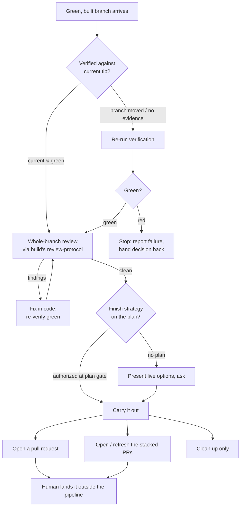

# Finish

**The finish phase decides how a green, verified branch re-enters the repository — it opens a pull request (or a set of stacked pull requests) and never merges anything, leaving a human to land the work.**

---

## 🌟 Overview (plain-language)

`finish` is the last phase of the pipeline. By the time it runs, the work is built and the branch is green; its job is not to write code but to get that finished branch back into the repository the way the team already agreed it would go.

Before it offers any choice, `finish` insists on two things. First, the branch must be **green and verified** — passing, with the passing backed by real command output rather than a claim. If the branch moved since verification last ran, `finish` re-runs verification rather than trusting a stale result; if it comes back red, `finish` stops and hands the decision back, because a red branch has nothing to integrate. Second, it reviews the **whole branch once, as a unit** — the complete change from the trunk the branch forks from to the branch tip — using the same review protocol `build` applies per task, so a problem that only shows up across tasks (a shared seam, a pattern that drifted over the branch's life) gets one read no single-task gate had the scope to catch.

Only then does it carry out the **finish strategy**. That strategy is usually not a fresh question: the plan gate — the last point a human signed off — already recorded it, so `finish` reads the plan behind the branch and carries out what was authorized without asking again. A branch built outside the pipeline, with no plan behind it, is the exception: there `finish` presents the live options and asks. Either way the pipeline **integrates only by pull request**. It opens the PR (or the stack) and stops. It never merges — not directly, not by landing a stack — so a human always does the actual landing, outside the pipeline.

**Worked example — a green stacked branch.** A plan whose Global Constraints carry `PR strategy: stacked` was built out task by task, each task on its own branch stacked on the one before it, and the branch is green. `finish` runs. It confirms verification is current for the branch tip, then reviews the whole stacked change end to end as one unit and finds nothing to fix. It reads the plan, sees the stacked strategy the plan gate authorized, and opens (or refreshes) one pull request per task, each current against its parent — writing every PR body from the shared description reference, none of them AI-signed. It hands back the stack's links and stops. A human reviews the PRs and lands them bottom-up, in the repository, on their own time; the pipeline is done.



## 🛠 Technical reference

The detail a reader who will change the phase needs.

- **Architecture.** Three units do the work — the conductor, its PR-body reference, and one skill it reuses from `build`:

  | Area | Unit | Responsibility |
  |---|---|---|
  | Conductor | `skills/finish/SKILL.md` | Requires green + verified (re-running verification if the branch moved), runs the whole-branch review, reads the plan-authorized finish strategy and carries it out — or, with no plan behind the branch, presents the live options and asks. Opens a PR or stack; never merges. |
  | PR body | `skills/finish/references/pr-description.md` | Shapes every pull-request body the conductor writes: plain language over jargon, no skill or process names, a verified checklist, and never signed for Claude or any AI vendor. Describes the branch; does not change it or decide whether to open a PR. |
  | Whole-branch review | `skills/build/references/review-protocol.md` (reused) | The per-task review protocol `build` already owns, applied once more at the branch boundary (trunk-to-tip). `finish` loads it as-is rather than defining its own review. |

- **Boundaries & invariants.**

  | Invariant | What it means |
  |---|---|
  | Never merges — ever | The pipeline integrates only by opening pull requests. No merge option is offered, not directly, not by landing a stack, not even as a prompt for the user to agree to. A human lands the branch or stack outside the pipeline. |
  | Green + verified first | No integration option appears until the branch is green and that green is backed by current command output. If the branch moved, verification is re-run; if it comes back red, `finish` stops rather than falling through to the options. |
  | Whole-branch review is not a new gate | The trunk-to-tip review surfaces findings that get fixed in code like any other review's, but the branch waits on no fresh human sign-off here — the plan gate already authorized how it finishes. |
  | PR bodies never AI-signed | No sign-off naming Claude, an AI, or any tool — no `🤖`, no "Generated with" footer, no `Co-Authored-By` trailer — unless a project has explicitly asked for such attribution. |
  | Finish strategy is the human's | Carried out from the plan gate's authorized choice, or asked when no plan backs the branch — never hard-coded to whichever option `finish` used last. Cleanup outside a plan needs explicit confirmation, since silence is never confirmation. |

## 🚀 Development & testing

The phase is a skill plus a reference and a reused protocol, so its tests are structural assertions over those files. Run the full foundation suite (what CI runs), then the checks that exercise `finish` specifically:

```bash
# Full foundation suite
sh engineering/tests/suite.sh

# The checks that exercise the finish phase
sh engineering/tests/absorb-approval-gate.sh   # plan-authorized finish strategy + whole-branch review, no new gate
sh engineering/tests/stacked-prs.sh            # stacked finishing: opens the stack, never lands it, issues no merge command
```

`absorb-approval-gate.sh` asserts that `finish` carries out the plan-recorded finish strategy without asking again, and that the whole-branch review runs via `build`'s review-protocol reference while staying a review rather than a fresh human gate. `stacked-prs.sh` asserts the stacked path offers "Open the stacked PRs", delegates to `using-stacked-pull-requests`, detects a stack from open PRs on the branch, has a human land it bottom-up, and offers no merge-directly option or `gh pr merge` command.

To change what the phase does, edit `skills/finish/SKILL.md`; to change how a pull-request body reads, edit `skills/finish/references/pr-description.md`. Changing the whole-branch review means editing `skills/build/references/review-protocol.md`, which `build` also uses — the two share it deliberately.
