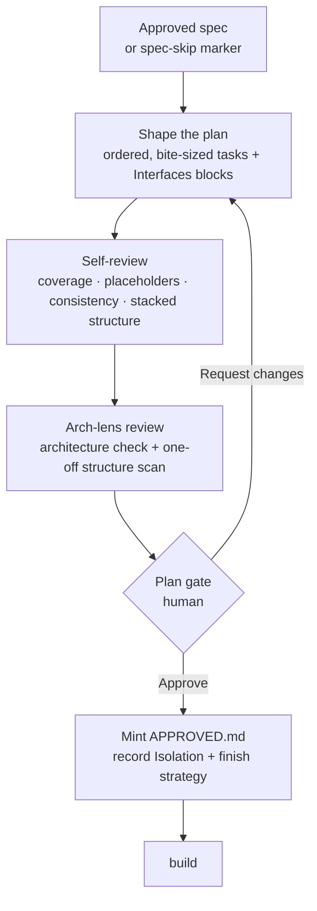

# Planning phase

**The planning phase turns one approved spec into exactly one ordered implementation plan — every
step small enough to build, verify, and commit in a single sitting — then holds the pipeline's
second human gate before any code is written.**

---

## 🌟 Overview (plain-language)

Once a spec is approved, the work still isn't ready to build: a spec settles *what* and *why*, but
not the order in which a builder should touch the code or where each test fits. The **planning
phase** closes that gap. It reads the approved spec and produces a single **plan** — an ordered run
of **tasks**, each one a small unit of work a builder can finish, prove green, and commit before
starting the next.

The rule that shapes everything is **one spec, one plan**. However large the spec, it becomes one
plan file — never split across several. If a spec is so big it won't fit even when broken into
**increments**, that's a sign its scope was drawn too wide, and the planner raises it as an
escalation rather than quietly splitting the plan to absorb it. The plan also never shrinks itself
by deferring work the spec put in scope: the approved In-scope list is the work, and the plan's job
is to turn all of it into tasks, not to renegotiate it downward or drop a "leave X for later"
question on the human mid-plan.

Three things make a task a task rather than a paragraph with a checkbox glued on:

- It **names exact file paths** — `Create:` or `Modify:` a real file — not "the relevant module."
- Where it changes behavior, it's **wired into the TDD cycle**: write the failing test, run it and
  confirm it fails for the stated reason, implement the minimum that makes it pass, run it again and
  confirm green, then commit. A step that jumps straight to "implement X" has skipped the part that
  proves the test would have caught the regression.
- Where it introduces or reshapes a boundary, it carries an **Interfaces block** — a short, fenced
  code sketch of the actual shape the step produces (the signature, the new type's fields, the shape
  returned) — so a reader sees the change without the whole implementation written ahead of time.

Every plan ships as a **stack**: one pull request per task, each branch based on the one before it,
so a reviewer approves and lands the tasks in order instead of reading the whole change at once.
This isn't a choice put to anyone — there's no single-PR alternative. Because the stack is linear,
the tasks run **sequentially**, never in parallel.

**Worked example.** Say the approved spec adds per-user rate limiting to an API: in scope are a
token-bucket limiter, per-user configuration, and a `429` response when a bucket is empty. The plan
lands as one file with three ordered tasks:

| Task | Opens | Work (TDD) | Closes |
|---|---|---|---|
| 1. Token-bucket limiter | Branch off the trunk | Failing test for `take()`, implement the bucket, green, commit | Submit stacked PR |
| 2. Per-user config | Branch off task 1's branch | Failing test for config lookup, implement, green, commit | Submit stacked PR |
| 3. `429` on empty bucket | Branch off task 2's branch | Failing test for the response, wire the handler, green, commit | Submit stacked PR |

Task 1 carries an Interfaces block sketching the limiter's surface:

```
class TokenBucket:
    def take(self, n: int = 1) -> bool   # True if n tokens were available and consumed
    # refills lazily on read against a monotonic clock; capacity and rate set at construction
```

Above the three tasks sits a **Global Constraints** block, copied verbatim from the spec's
Constraints and any decision table, plus the three fixed markers every plan records —
`Finish strategy: pull request`, `PR strategy: stacked`, and the `Isolation:` choice the human made
at the gate.

Before the human ever sees this plan, it goes through two review passes: a document-level
**self-review** (does every spec item have a task; any placeholders; consistent task shape; the
stacked structure present on every task) and an **arch-lens review** that judges the *design* the
Interfaces blocks sketch. Only then does the plan reach the **plan gate**, where a human approves
it.



## 🛠 Technical reference

The detail for a reader who will change how planning works.

**Architecture.**

| Area | Unit | Responsibility |
|---|---|---|
| Plan phase | `skills/plan/SKILL.md` | Reads the approved spec, checks its approval marker, shapes it into one ordered plan of bite-sized TDD tasks with Interfaces blocks and a Global Constraints block, runs the self-review, invokes the arch-lens review, then holds the plan gate and mints the plan-approval marker on approval. |
| Plan design review | `skills/plan/references/arch-lens.md` | Runs after self-review, before the gate: an architecture check over the tasks' sketched interfaces (via `engineering:using-codebase-design` in review mode) plus a scan for reinvented data structures, returning the plan revised for what it found. Closes objective shape defects directly; flags one-off structures and genuine trade-offs to the human as explicit choices. |
| Stacking | `engineering:using-stacked-pull-requests` | Opens and maintains the one-PR-per-task stack the plan's `PR strategy: stacked` marker names. Referenced by every task's branch-start and submit-PR steps; the pipeline opens the stack but never lands it. |
| Deferral guard | `engineering:refusing-deferral` | Backs the no-scope-renegotiation invariant: the planner escalates a genuine new obstacle rather than punting requested work to a silent "later." |

**Where the plan lives.** One file per run at `.engineering/<run>/plan/<YYYY-MM-DD>-<topic>.md`, where
`<YYYY-MM-DD>` is the day the plan is written (not the spec's approval date) and `<topic>` reuses the
spec's own topic slug so spec and plan sort next to each other. Never an ordinal-suffixed set.

**Preconditions.** The plan starts from one of two markers, and refuses without either:

| Marker | Meaning | What the plan reads |
|---|---|---|
| `.engineering/<run>/to-spec/APPROVED.md` | The spec cleared its own gate | The approved Tier-1 spec's Constraints and decision table |
| `.engineering/<run>/to-spec/SPEC-SKIPPED.md` | `brainstorming` opted out of spec creation for a small, well-pinned change | The recommended design handed over, as the approach to sequence |

An `Approved` status line with no marker behind it is the signature of a hand-edited spec — the
planner treats the marker as the trace and the status line as only the checkbox, and stops.

**Global Constraints markers.** The plan opens with a Global Constraints section carrying the spec's
Constraints verbatim plus three fixed lines every downstream skill reads:

| Marker | Value | Read by |
|---|---|---|
| `Finish strategy` | `pull request` (fixed — the branch re-enters only as a PR) | `finish` |
| `PR strategy` | `stacked (one PR per task, via engineering:using-stacked-pull-requests)` | `build`, `finish` |
| `Isolation` | `worktree` or `feature-branch` (the human's choice at the gate) | `build`, to establish the workspace |

**Boundaries & invariants.**

- **One spec, one plan.** Every spec becomes exactly one plan file. Increments organize tasks under
  headings *inside* that one file and one gate; they do not each earn their own plan or approval.
- **No scope renegotiation, no silent deferral.** The plan turns all of the spec's In-scope work
  into tasks. It never moves a requested item to a Deferred bucket the spec didn't already carry, and
  never asks the human to defer in-scope work at the gate. Requested work has two honest fates — a
  task that builds it, or a deferral the approved spec already records — and no third.
- **Stacked, always.** There is no single-PR alternative and no question to ask. Every task opens
  with a branch-start step (off the previous task's branch; the first off the trunk) and closes, after
  its commit, with a submit-PR step. A task missing either end collapses two tasks into one PR or
  leaves a task with no PR — a plan defect, not the builder's.
- **Both gates are marker-backed.** The plan gate is the pipeline's second human gate (the first is
  the spec gate). Approval mints `.engineering/<run>/plan/APPROVED.md` via `run-context.sh plan
  <slug>`; `build` refuses to run without it. The marker is minted only on approval, never before.
- **Arch-lens runs before the human gate.** The design review is a machine pass — with narrow
  per-item human approvals for one-off structures — and it completes before the plan is ever presented,
  so the plan the human approves is the reviewed one. The plan is not presented until the review returns.

## 🚀 Development & testing

The plan phase is a skill and its reference, so its tests are structural assertions over that prose
and the skills' shape. Run the full foundation suite, which is what CI runs:

```bash
sh engineering/tests/suite.sh
```

The checks that bear on the plan phase:

```bash
sh engineering/tests/plan03.sh        # frontmatter shape of plan (among sibling skills) + triage checks
sh engineering/tests/stacked-prs.sh   # the stacked-PR content gate the plan's tasks rely on
```

(The `plan02.sh` / `plan03.sh` names are ordinal, not scoped — `plan02.sh` is a repo-wide
NOTICE-leak scan that does not touch the plan phase, so it is not listed here.)

To change how a plan is shaped or gated, edit `skills/plan/SKILL.md`; to change how its sketched
interfaces are reviewed before the gate, edit `skills/plan/references/arch-lens.md`.
