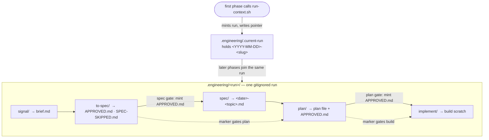

# Run directories

**The file-based backbone every pipeline phase shares: one gitignored directory per unit of work, minted once and joined by every phase after, where each phase drops its artifacts in its own subdir and gates leave a marker file behind as proof they were cleared.**

---

## 🌟 Overview (plain-language)

The pipeline has no issue tracker and no shared database. A single piece of work — a feature, a fix — is instead held together by a **run**: one directory under `.engineering/` that every phase reads from and writes to as the work moves from discovery to a pull request. The run is scratch. It is gitignored, so nothing in it lands on a branch; it is where the phases talk to each other.

A run has an id of the form `<YYYY-MM-DD>-<slug>` — a date plus a short kebab-case handle, e.g. `2026-09-09-run-directories`. Its directory is `.engineering/<run>/`. Which run is active is recorded in one small pointer file, `.engineering/.current-run`, that holds that id and nothing else.

Nobody types this id or invents it by hand. The **`run-context.sh`** script mints it. A phase calls the script with its own name; the script either creates the run (writing the pointer and the date-slug id) or, if a run is already active, joins the existing one and ignores any slug it was passed. Either way it prints — and creates — the absolute path of that phase's own subdirectory, `.engineering/<run>/<phase>/`. So the first phase in a session opens the run and every later phase falls into the same one automatically.

Inside the run, each phase owns a **subdir** and writes its artifacts there: signal writes its brief under `signal/`, spec writes the Tier-1 spec under `spec/`, plan writes the plan under `plan/`, build works under `implement/`. Phases never write into each other's subdirs — the spec phase, for one, is only permitted to write the run's `spec/` and `to-spec/` dirs.

The gates between phases leave **markers**. A marker is a small file whose mere existence is the trace that a gate was cleared — not a status line, not a checkbox, an actual file on disk. When the human approves a spec, the spec phase mints `to-spec/APPROVED.md`; when the human approves a plan, the plan phase mints `plan/APPROVED.md`. The next phase down checks for the marker before it will run, and refuses if only a status says "Approved" with no marker behind it.

**Worked example.** A request arrives. `signal` runs `run-context.sh signal login-throttle`; no run is active, so the script stamps `2026-09-09-login-throttle` into `.engineering/.current-run`, creates `.engineering/2026-09-09-login-throttle/signal/`, and prints it. Signal writes `signal/brief.md` there. Design and spec follow: `spec` calls `run-context.sh to-spec` — a run is already active, so the slug is moot and it joins the same run — writes the spec under `spec/`, and on the human's approval mints `to-spec/APPROVED.md`. `plan` starts by reading the pointer, confirms `to-spec/APPROVED.md` exists (refusing if it does not), writes the plan under `plan/`, and on approval mints `plan/APPROVED.md`. `build` reads the pointer, confirms `plan/APPROVED.md`, and works under `implement/`. Every phase found its way into the one directory without ever being told the run id.



## 🛠 Technical reference

The detail a reader who will change the run model needs.

**Architecture.** The whole mechanism is one script plus a directory convention.

| Area | Unit | Responsibility |
|---|---|---|
| Run minting / joining | `scripts/run-context.sh` | Given a phase `<name>` (and, for a new run, an optional `[slug]`): if `.engineering/.current-run` exists, read the active run from it; otherwise build the id `<date>-<slug>` (slug sanitised to kebab, defaulting to `run`) and write the pointer. Prints and `mkdir -p`s the absolute path of `.engineering/<run>/<name>/`. Owns run identity; a caller must not name a run itself. |
| Active-run pointer | `.engineering/.current-run` | A one-line file holding the active run id `<YYYY-MM-DD>-<slug>`. Written by the first caller, read by every later caller so they join the same run. The single source of truth for "which run is now". |
| Run directory | `.engineering/<run>/` | The per-run home for everything a run produces — every phase's subdir, its spec, its plan, its markers, its scratch. Gitignored (`.engineering/` is in `.gitignore`), so a run never lands on a branch. |
| Phase subdir | `.engineering/<run>/<phase>/` | One directory per phase, created on demand by `run-context.sh`. The phase writes its artifacts here and nowhere else; phases do not cross-write. |
| Per-invocation leaf | `.engineering/<run>/<phase>/<NNN>/` | With `--fresh`, `run-context.sh` returns the next zero-padded numeric leaf under the phase dir instead of the shared dir, so a phase invoked more than once in a run keeps each invocation's scratch isolated and ordered rather than re-reading a stale earlier one. |

**Phase subdirs.** Each is written by one phase and read by the next.

| Subdir | Phase | Holds |
|---|---|---|
| `signal/` | signal | The verbatim request (`00-request.md`) and the interrogated brief (`brief.md` §1–§6). |
| `triage/` | triage | The defect entrance's reproduction and isolation record. |
| `to-spec/` | spec / brainstorming | The spec-gate markers (below). The slug stays `to-spec` even though the spec file itself lands in `spec/`. |
| `spec/` | spec | The single Tier-1 spec, `<YYYY-MM-DD>-<topic>.md`. |
| `plan/` | plan | The single plan file, `<YYYY-MM-DD>-<topic>.md`, plus the plan-approval marker. |
| `implement/` | build | Build's working scratch as it executes the plan task by task. |

**Markers.** A marker file is the durable trace a gate was cleared. Its existence is the approval — the downstream phase checks for the file, not for a status line.

| Marker | Minted by | Means |
|---|---|---|
| `to-spec/APPROVED.md` | spec, at the spec-approval gate | The human approved the Tier-1 spec. `plan` requires this (or the skip marker) before it will plan. |
| `to-spec/SPEC-SKIPPED.md` | brainstorming, at the right-size bypass | The human explicitly opted to skip spec creation for a small, well-pinned change. Accepted by `plan` in place of `APPROVED.md`. |
| `plan/APPROVED.md` | plan, at the plan-approval gate | The human approved the implementation plan (and, for a stacked run, the PR strategy). `build` requires this before it will build. |

**Boundaries & invariants.**
- **The run id is not the agent's to invent.** `run-context.sh` mints it — a date plus a sanitised slug — and records it in `.engineering/.current-run`. A phase asks the script for its directory; it never constructs a run id or a path by hand. The first caller creates the run, every later caller joins it, so two invocations in one session always resolve to the same run.
- **The marker is the trace; a status is only a checkbox.** A gate is cleared when its marker file exists, not when a document says `Approved`. An `Approved` status with no marker behind it is the signature of a hand-edited status line or an artifact written before its gate; downstream phases refuse it and stop rather than proceed on the checkbox alone.
- **Phases stay in their own subdir.** Each phase writes only its subdir under the run; it does not write another phase's dir. The spec writer, for instance, is permitted only the run's `spec/` and `to-spec/` dirs.
- **A run is scratch, and gitignored.** `.engineering/` is in `.gitignore`, so a run's briefs, specs, plans, markers, and scratch never land on a branch. There is no issue tracker and no external state — the directory *is* the shared state. (When build moves to a worktree it carries the run's `.engineering/` along, since an untracked dir does not follow a branch switch on its own.)

## 🚀 Development & testing

The run model is one shell script, covered by one shell test.

```bash
# The test that covers run-context.sh directly
sh engineering/tests/run-context.sh

# The full foundation suite (what CI runs; includes the above)
sh engineering/tests/suite.sh
```

`engineering/tests/run-context.sh` asserts the behaviours that hold the model together: two invocations in one session resolve to the **same** run (the second joins rather than re-mints), the `.engineering/.current-run` pointer is written, each phase's scratch dir is created, the run id matches `<YYYY-MM-DD>-<slug>`, and `--fresh` returns distinct, ordered, zero-padded leaves (`001`, `002`, …) under the shared phase dir of the same run.

To change how runs are minted or where phase dirs land, edit `engineering/scripts/run-context.sh` and update `engineering/tests/run-context.sh` to match.
