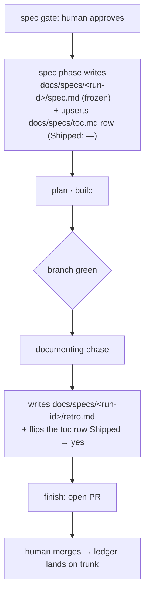

# Spec ledger

**The committed record of every spec the pipeline approves: on approval the spec is frozen into a tracked ledger under `docs/specs/`, and when the work ships it gains a companion retrospective — so past specs can be read, compared, and learned from long after the run that produced them.**

---

## 🌟 Overview (plain-language)

A spec used to be **ephemeral**. The `spec` phase wrote it into the gitignored run directory (`.engineering/<run>/spec/`), so once a run ended the spec left no committed trace — there was no durable record of what was specified, and no way to look back across past specs to see where they fell short.

The **spec ledger** fixes that. It is a tracked directory, `docs/specs/`, with one subdirectory per run holding two files:

- **`spec.md`** — a **frozen** copy of the approved spec, written by the `spec` phase at the moment it clears the spec gate. It is an immutable snapshot: never edited afterwards.
- **`retro.md`** — a **retrospective** written by the `documenting` phase when the work ships, judging what actually landed against that frozen spec. It is where drift and lessons live, so the spec stays frozen and the retro carries the outcome.

A ledger index, **`docs/specs/toc.md`**, lists every entry (newest first) so the ledger is browsable rather than a pile of directories.

Two phases write to the ledger, each the one that holds the right inputs — the spec phase knows the approved spec; the documenting phase, running on the green branch, knows what actually shipped:



**Worked example — this very feature.** The run that built the spec ledger is itself in the ledger: `docs/specs/2026-09-11-commit-specs-retro/spec.md` is its frozen spec, `retro.md` its retrospective (which records, among other things, that the ledger's directory key changed during the build), and `docs/specs/toc.md` carries its row with `Shipped: yes`.

The `retro.md` is worth reading even when a spec was accurate. Beyond a per-section accuracy verdict, it records five cross-cutting axes — the raw material a future retrospective analysis reads to improve the pipeline:

- **Process friction & cost** — where effort was burned, and what capability would have prevented it.
- **Rework & churn** — re-designs, re-plans, review rejections, mid-build reversals.
- **Scope fidelity** — whether the spec's scope and non-goals held.
- **Gate correction load** — how much the human had to correct at the spec and plan gates.
- **Assumption & open-question outcomes** — which of the spec's open questions and baselines resolved cleanly, and which bit.

## 🛠 Technical reference

The detail a reader who will change this needs.

- **Data model.** One directory per run under `docs/specs/`, keyed by the **full run id** — the entire `.engineering/.current-run` value, `<YYYY-MM-DD>-<slug>` (date prefix included). The full dated id is used, not the bare slug, so two runs sharing a slug on different days never collide on the same directory and overwrite a `spec.md`.

  ```
  docs/specs/
    toc.md                                  # the ledger index (Date | Spec | Shipped | Links)
    <YYYY-MM-DD>-<slug>/
      spec.md                               # frozen approved spec (written at approval)
      retro.md                              # retrospective (written at ship)
  ```

- **Architecture.** Five units do the work, split between the two writing phases and the two format references they compose:

  | Area | Unit | Responsibility |
  |---|---|---|
  | Writer (approval) | `skills/spec/SKILL.md` | At the spec gate, alongside minting the approval marker, writes the frozen `docs/specs/<run-id>/spec.md` and upserts its `docs/specs/toc.md` row with `Shipped: —`. |
  | Writer (ship) | `skills/documenting/SKILL.md` | On the green branch, **unconditionally** writes `docs/specs/<run-id>/retro.md` and flips the toc row's `Shipped` to `yes` — separate from, and not gated by, the judged feature-doc path. |
  | Retro format | `skills/documenting/references/RETRO-FORMAT.md` | The `retro.md` contract: front-matter spine (`spec`/`shipped`/`diff`), per-section accuracy verdicts mirroring the spec's sections, and five cross-cutting axis sections. |
  | Index format | `skills/spec/references/SPECS-TOC-FORMAT.md` | The `docs/specs/toc.md` row shape (`Date \| Spec \| Shipped \| Links`), a dedicated genre kept separate from the feature-doc `docs/toc.md`. |
  | Index | `docs/specs/toc.md` | The browsable ledger index, upserted by the `spec` phase and updated by `documenting`. |

- **Boundaries & invariants.**

  | Invariant | What it means |
  |---|---|
  | `spec.md` is frozen | The committed spec is an immutable snapshot; outcome and drift live only in `retro.md`, never by editing `spec.md`. |
  | Run-id key is collision-free | The ledger directory is the full dated run id, so two runs never share a directory. |
  | retro.md is unconditional | Every green run leaves a `retro.md`, even one whose feature-doc step was skipped; it is terse-by-default, so an axis with nothing notable gets one line. |
  | No orphan on trunk | The committed spec rides the run's branch and lands on trunk only when the PR merges; an approved-but-abandoned run leaves nothing on trunk. |
  | No new gate | Both writes are unattended — the plan gate already authorized the run. |
  | `SPEC-FORMAT.md` unchanged | The ledger adds the `retro.md`/index formats; it does not change the spec format itself. |

## 🚀 Development & testing

The mechanism is skill bodies plus reference docs, so its tests are POSIX-sh structural assertions over those files.

```bash
# Full foundation suite (every non-live check; CI also runs the live e2e suite)
sh tests/suite.sh

# The checks specific to the spec ledger
sh tests/retro-format.sh       # the retro.md contract (RETRO-FORMAT.md)
sh tests/committed-specs.sh    # the spec skill's approval-time write, SPECS-TOC-FORMAT.md, the toc scaffold,
                               # and that documenting flips the row's Shipped column
sh tests/documenting-phase.sh  # the unconditional retro step in the documenting phase
```

To change the retro record's shape, edit `skills/documenting/references/RETRO-FORMAT.md`; to change the index row, edit `skills/spec/references/SPECS-TOC-FORMAT.md`. The two writing behaviors live in `skills/spec/SKILL.md` (approval) and `skills/documenting/SKILL.md` (ship).
