# Committed specs & retro ledger — spec

**Date:** 2026-09-11
**Author:** @andrew (Andrew Leach)
**Status:** Approved
**Origin:** signal (discovery)

## 0. ELI5

Right now, every spec the pipeline writes lives in a scratch folder that git ignores, so
once a piece of work is done its spec vanishes — there's no lasting record of what we said
we'd build, and no way to look back and learn from it. This change makes each **approved
spec** get saved into the tracked `docs/` folder, and adds a companion **retro** note —
written when the work ships — that judges the finished work against the spec along several
axes: how each spec section held up, and cross-cutting lenses like where the *process itself*
was wasteful (e.g. "we burned a lot of effort rediscovering X; feature Y would have prevented
it"), how much the work churned, whether scope held, and how hard the human gates had to
push. Together they build a durable, reviewable ledger of
past specs and their outcomes. We'll know it worked when a finished run leaves both a
committed `spec.md` and a `retro.md` under `docs/specs/`, listed in an index. A separate
tool that mines this ledger to propose pipeline improvements — `engineering-retro` — is a
**follow-on project in its own repo**, not part of this change; this change just produces
the material it will read.

## 1. Problem

Specs produced by the pipeline are ephemeral: the `spec` skill writes them to
`.engineering/<run>/spec/<date>-<topic>.md`, which is gitignored, so once a run ends the spec
leaves no committed trace. There is therefore no durable, reviewable record of what was
specified, and — the deeper cost — no learning loop: the pipeline cannot look back over its
own past specs to see where they fell short and improve itself. Felt today by the pipeline
maintainer, who has no accumulated corpus to reason over.

## 2. Users & stakeholders

- **Author / primary consumer / sole sign-off:** @andrew (Andrew Leach), maintainer of the
  `dashworthy` marketplace plugins.
- **Downstream consumers (not decision-makers):** the AI agents running the pipeline (which
  read `docs/` as context), other installers of the `dashworthy/engineering` marketplace, and
  the future `engineering-retro` analyzer.
- Sign-off on this work rests solely with @andrew.

## 3. Goals & success criteria

| Criterion | How it's checked |
|---|---|
| The `spec` skill, on approval, writes the frozen approved spec to `docs/specs/{slug}/spec.md` | Approve a spec in a run; confirm `docs/specs/{slug}/spec.md` exists on the branch and matches the approved `.engineering/<run>/spec/…` content |
| Every run reaching `documenting` on a green branch leaves `docs/specs/{slug}/retro.md` (unconditional — even when the judged feature-doc step skips) | Run a change that documents nothing; confirm `retro.md` is still written |
| `retro.md` conforms to the new format: front-matter spine, per-section verdicts (Group A), and the five Group-B axis sections (process friction & cost, rework & churn, scope fidelity, gate correction load, assumption & open-question outcomes) | `retro.md` parses to the `RETRO-FORMAT.md` shape; a format test asserts the front-matter keys, the closed verdict set, and the five Group-B section headings |
| The retro/outcome format exists as a committed reference doc that `documenting` composes | `references/RETRO-FORMAT.md` exists and `skills/documenting` cites it |
| Committed specs are discoverable via a dedicated `docs/specs/toc.md` index | After approval, the new spec appears as a row in `docs/specs/toc.md` |
| `docs/specs/spec.md` lands on `main` only when the run's PR merges (no orphan on `main` for an abandoned run) | The write rides the working branch; inspect that an unmerged run adds nothing to `main` |

## 4. Constraints

- **This run is the `engineering` repo only.** The committed-specs mechanism ships here.
  `engineering-retro` is a separate follow-on run in its own repo/marketplace (see §5 Deferred) —
  the pipeline branches-and-PRs one repo per run, and the analyzer needs a corpus to exist first.
- **Fit the existing `docs/` model.** `docs/` is the tracked tree; today it holds feature docs at
  `docs/{domain}/{feature}/README.md` plus the feature-keyed `docs/toc.md` (upserted by
  `documenting`). Committed specs go under a new, dated, per-run `docs/specs/{slug}/` area with its
  own index — a different genre from feature docs, kept separate from `docs/toc.md`.
- **The approved spec is immutable.** `spec.md` is the frozen approved snapshot; outcome/drift is
  captured only in the companion `retro.md`, never by editing `spec.md`.
- **`references/SPEC-FORMAT.md` (§0–§8) is unchanged.** The retro/outcome record gets its own new
  reference doc; the spec format is not redesigned.
- **The retro/outcome format is a reference doc, not a skill** — following the `SPEC-FORMAT.md`
  pattern that a phase composes.
- **`{slug}` is the run slug**, reusing the `spec` skill's existing `<topic>` derivation (the
  `<slug>` portion of `.current-run`, or a title-derived slug when no run is active).

## 5. Scope

**In:**
- Extend the `spec` skill so that, at the approval gate (when it stamps `Approved` and mints
  `.engineering/<run>/to-spec/APPROVED.md`), it also writes the frozen approved spec to
  `docs/specs/{slug}/spec.md` and registers it in `docs/specs/toc.md`. The existing
  `.engineering/<run>/spec/<date>-<topic>.md` write is unchanged.
- Add an **unconditional** step to the `documenting` phase that writes `docs/specs/{slug}/retro.md`
  from the approved spec + the shipped whole-branch diff, per the new `RETRO-FORMAT.md`. This is
  separate from — and not gated by — the judged feature-doc path.
- Add `references/RETRO-FORMAT.md` defining the `retro.md` contract (see §6).
- Add the `docs/specs/toc.md` index and its row format.
- Tests/structural assertions covering the above (mirroring the repo's shell-test convention).

**Out (non-goals):**
- **Backfill of past specs** — "moving forward" only; existing/old specs are not migrated (they
  don't exist in committable form and re-deriving them is not the point).
- **The `engineering-retro` analyzer** — deferred (below); out of this run because it's a separate
  repo and needs a corpus first.
- **Redesigning `SPEC-FORMAT.md`** — the spec format is deliberately left alone.

**Deferred:**

| Item | Trigger to revive |
|---|---|
| `engineering-retro` standalone plugin (its own `dashworthy` repo/marketplace): manually-invoked analyzer that reads the last 5–10 `docs/specs/{slug}/{spec,retro}.md` pairs, finds where specs/pipeline fell short, emits its own report + improvement proposals; never auto-applies, never auto-invoked | This run merges and a real spec/retro corpus (several runs) has begun to accumulate |

## 6. Approach (from the design dialogue)

Committed specs enter `docs/specs/` as a per-spec directory `docs/specs/{slug}/`, mirroring the
per-feature shape of the existing feature-doc tree. The two artifacts are written by the two phases
that hold the right inputs — **each artifact written where its inputs live**:

- **`spec` writes `docs/specs/{slug}/spec.md` at the approval gate.** The `spec` skill is already
  the single Tier-1 spec writer; on approval it also writes the frozen copy and registers the index
  row. The commit rides the run's working branch, so it lands on `main` only when the PR merges —
  an approved-but-abandoned run leaves no orphan on `main`.
- **`documenting` writes `docs/specs/{slug}/retro.md` at ship time**, unconditionally, from the
  approved spec + the shipped whole-branch diff it already has.

```mermaid
flowchart TD
    A[spec gate: human approves] --> B[spec skill: mint APPROVED.md<br/>+ write docs/specs/&#123;slug&#125;/spec.md<br/>+ upsert docs/specs/toc.md]
    B --> P[plan · build]
    P --> G{branch green}
    G --> D[documenting phase]
    D --> D1{judged: docs<br/>behavior changed?}
    D1 -- yes --> FD[write/patch feature doc<br/>+ upsert docs/toc.md]
    D1 -- no --> SK[record skip reason]
    D --> RM[[unconditional:<br/>write docs/specs/&#123;slug&#125;/retro.md<br/>per RETRO-FORMAT.md]]
    FD --> FIN[finish: open PR]
    SK --> FIN
    RM --> FIN
    FIN --> M[human merges → docs/specs/* lands on main]
```



**Alternatives weighed:**
- *Which phase writes `retro.md`* — `documenting` (chosen: owns `docs/` writes, runs on the green
  branch, has the shipped diff, and its output sits inside the doc-validation fan-out) vs. `finish`
  (rejected: writes no docs today, runs after `documenting`, would give it a doc-writing job outside
  its PR-opening identity).
- *When `spec.md` is committed* — at approval (chosen: the spec phase already owns spec-writing; a
  branch-riding commit avoids orphans on `main`) vs. at ship (rejected: splits spec-writing away
  from the spec phase for no gain).
- *Run scope* — two sequenced runs (chosen: respects one-repo-per-run and the corpus-first ordering)
  vs. one cross-repo run or in-repo-then-extract scaffolding (rejected: fights the pipeline's
  single-repo build/finish model).

**Boundary shaped — the `retro.md` format contract (`RETRO-FORMAT.md`).**
This is the load-bearing boundary: `retro.md` is *written* by `documenting` now and *read* by the
future `engineering-retro` analyzer, so it is a producer/consumer contract, not just a template.
The shape lenses chose a **spec-section-anchored narrative with a thin structured spine** (a plain
shape, no GoF pattern) over a free-form narrative (too shallow — no stable keys to aggregate across
runs) and a rigid typed schema (fat, and it pre-empts the analyzer's own job of *discovering*
shortfall categories, over-fitting a consumer not yet built). What a reader/writer must know:

- **Front-matter spine** — only facts stable and knowable at write time regardless of any consumer:
  - `spec:` the paired spec slug (join key to `docs/specs/{slug}/spec.md`)
  - `shipped:` boolean — did the run ship
  - `diff:` the shipped-diff reference (commit range and/or PR number)
- **Group A — per-section accuracy. Body mirrors the spec's own §0–§8** (SPEC-FORMAT is stable and
  unchanged this run, so it is the natural, already-existing schema — no invented taxonomy). Each
  section that warrants it carries a **closed-set verdict** — `held` | `drifted` | `underspecified`
  | `n-a` — then **prose** for the *why*. Verdict categories stay this coarse deliberately:
  discovering *kinds* of shortfall is the analyzer's job, not the format's.
- **Group B — five cross-cutting axis sections**, each its own `##` heading, each a different lens
  on "where we fell short" and each feeding a different pipeline improvement. All stay **prose with a
  light per-entry convention** (a symptom, then a suspected cause/fix), so the analyzer mines
  recurring patterns across runs rather than the format freezing a taxonomy:
  - `## Process friction & cost` — where the run was costly/wasteful ("burned a lot of
    effort/tokens figuring out X"), each entry naming the suspected cause and a **candidate
    capability/feature that would have prevented it**, optionally tagged with the phase. The primary
    raw material for `engineering-retro`'s improvement proposals.
  - `## Rework & churn` — how much the run looped back: re-designs, re-plans, build-review
    rejections, mid-build approach reversals. Flags where the spec/plan wasn't stable to build from.
  - `## Scope fidelity` — whether §5 In/Out/Deferred held: non-goals pulled in, deferred items
    dragged forward, increments that grew. The scope-creep lens.
  - `## Gate correction load` — how much the human corrected at the spec and plan gates (rounds,
    magnitude), which points at whether the upstream phase (signal/triage/brainstorming) did its
    job. The axis that most sharply informs "improve the entrances."
  - `## Assumption & open-question outcomes` — the spec's §8 open questions and any baseline
    assumptions: which resolved cleanly, which bit us, which were never revisited. Catches specs that
    shipped on guesses; ties back to signal's unchecked-baseline threads.

- **Terse by default.** `documenting` writes `retro.md` on *every* run, so an axis with nothing
  notable gets one line (e.g. "nothing notable") rather than a manufactured entry — the format must
  not become a chore that pressures invented content. The reason a retro is still worth committing
  when every spec section `held` is that Group B often has signal even when Group A is clean.

Leak tests: the 4-value verdict is a *designed* contract (intentional exposure), not accidental
leakage; the join key is the spec section, stable because SPEC-FORMAT is stable. Worked example:

```
---
spec: 2026-09-11-commit-specs-retro
shipped: true
diff: <base>..<tip> (PR #NNN)
---
# Retro — commit-specs-retro

## §1 Problem — held
Matched what shipped.
## §3 Success Criteria — underspecified
"indexed/discoverable" didn't pin the index format; resolved late during build.
## §6 Approach — drifted
Wrote retro.md in documenting as planned, but the index moved from a toc row to docs/specs/toc.md.

## Process friction & cost
- Burned several rounds re-deriving where docs/ lived and how documenting writes it.
  Suspected fix: a cheaper "map the docs tree" consult primitive up front. [phase: brainstorming]
## Rework & churn
- Retro format revisited once (added 4 axes at the spec gate). Otherwise stable.
## Scope fidelity
- Held. Non-goals (no backfill, SPEC-FORMAT untouched) held; engineering-retro stayed deferred.
## Gate correction load
- Spec gate: 1 "request changes" (retro axes). Plan gate: nothing notable.
## Assumption & open-question outcomes
- §8 slug-collision: resolved in plan. Baseline "index = toc row": wrong, revised to docs/specs/toc.md.
```

*No increments.* The change lands cleanly in one pass (two skills, one reference doc, one index,
tests) and does not need slicing.

## 7. Existing context

Modules this work touches:
- **`skills/spec/SKILL.md`** — the single Tier-1 spec writer and spec-gate holder; gains the
  `docs/specs/{slug}/spec.md` write + index upsert on approval. Its `<topic>`/slug derivation is
  reused for `{slug}`.
- **`skills/documenting/SKILL.md`** — owns `docs/` writes and runs on the green branch; gains the
  unconditional `retro.md` step. Its producer/validation structure
  (`skills/using-documentation/SKILL.md`, `skills/documenting/references/…`) is the model for how a
  format reference is composed.
- **`references/` (repo root)** — home of `SPEC-FORMAT.md`; gains `RETRO-FORMAT.md`.
- **`docs/` + `docs/toc.md`** — the tracked doc tree; gains `docs/specs/` and `docs/specs/toc.md`.
- **`.gitignore`** — ignores `.engineering/`; `docs/specs/` is under the already-tracked `docs/`, so
  no ignore change is needed (confirm during build).
- **`tests/`** — shell-based structural assertions; gains coverage for the new writes/format.

`docs/` files the design consulted (load-bearing on this design):
- `docs/toc.md` — the feature-doc index model and the fact that its rows are feature-keyed.
- `docs/pipeline/documentation/README.md` — the `documenting`/`using-documentation` producer split,
  the judged/skippable feature-doc path, and the "no new gate" invariant.
- `docs/pipeline/finish/README.md` — confirmed `finish` writes no docs and runs after `documenting`,
  supporting the choice of `documenting` as the `retro.md` writer.

## 8. Open questions

- **Slug collisions:** two runs sharing a slug on the same day would collide at
  `docs/specs/{slug}/`. Reuse of the `spec` skill's existing `<topic>` derivation (which is
  date-prefixed at the run level) is expected to suffice; the plan should confirm the exact
  `{slug}` value and a collision rule. Does not block starting.
- **`docs/specs/toc.md` row shape:** whether it reuses the existing `TOC-FORMAT.md` columns or
  defines a spec-specific row (e.g. date · slug · shipped · links to spec/retro). A plan-level
  detail; does not block starting.
