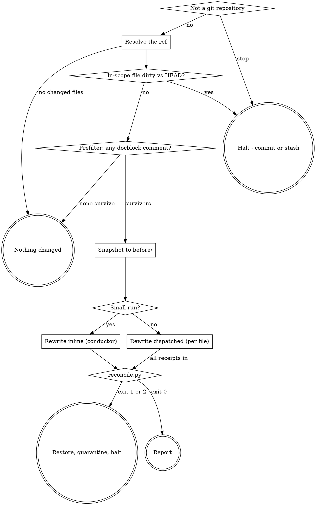

# Document

## The two rules

> **Rule one - prose only.** vernacular rewrites the human-readable descriptions of docblocks
> that already exist. It never writes, edits or deletes a structured annotation, never changes a
> line of executable code, and never authors a docblock on a symbol that has none.

> **Rule two - the context firewall, above the inline threshold.** On a **large** run the
> conductor **never opens a source file:** it routes paths and line ranges, dispatches, and reads
> receipts. On a **small** run - the inline path defined in `## Sizing the run` - the conductor
> reads and rewrites the files itself. That relaxation is deliberate and announced, never silent:
> a subagent cold-start costs more than a few small files briefly held in the conductor's context.

Rule one is proved by `scripts/reconcile.py`, not asserted, on **both** paths - the byte proof is
the safety net whether a file was rewritten inline or by a subagent. Rule two is a token trade,
not a correctness one; reconcile is what guarantees correctness. When an instruction below appears
to conflict with Rule one, the rule wins and the run halts.

## Pipeline



There is no separate verify stage. A rewriter flags any description it could not fully ground in
the code, and the human reads those under **Verify these yourself** in the report - the working
tree is unstaged, and `git diff` is the review.

## Preflight

1. **Not a git repository** - stop.
2. **Resolve the ref.** No argument means the current branch against its merge-base with the
   default branch:

   ```sh
   BASE=$(git merge-base HEAD "$(git symbolic-ref --short refs/remotes/origin/HEAD | sed 's|^origin/||')")
   git diff --name-only "$BASE"...HEAD
   ```

   Hunk ranges come from the **after-side** line numbers of the diff, and the diff body must never
   enter this context on the dispatched path. `--unified=0` does not achieve that on its own: it
   removes the unchanged context lines but still prints every changed line, and the `@@` header's
   own trailing suffix carries the enclosing function's source text. Filter the ranges out before
   the result can reach you:

   ```sh
   git diff --unified=0 "$BASE"...HEAD -- <path> \
     | sed -n 's/^@@ [^@]* +\([0-9]*\(,[0-9]*\)*\) @@.*/\1/p'
   ```

   That prints `104,28` style tokens — a start line and a length — and nothing else. **Never run a
   bare `git diff` at any context level** on the dispatched path: its output is the user's source.
3. **Any in-scope file modified relative to `HEAD`** - `git status --porcelain -- <paths>` -
   **halt**, name the files, say commit or stash.

   The comparison is against `HEAD`, not the merge-base: every in-scope file differs from the
   merge-base by definition, since that is what put it in scope. What is at risk is work the
   branch has not committed yet. This is load-bearing. The whole delivery model is "the rewrites
   land in your working tree, `git diff` is the review, `git checkout` is the undo," and that undo
   is only safe if there is nothing else in the file to lose.
4. **No changed files** - say so plainly and stop.
5. **Prefilter to files that carry a docblock.** vernacular improves docblocks that already exist;
   a file with no comment leader anywhere has none to improve, so it is dropped **before any
   dispatch or read into this context.** This is a shell operation - the bytes never enter your
   context - and it is language-agnostic, the same leader set `reconcile.py` recognises:

   ```sh
   grep -lE '(/\*\*|^[ \t]*\*|///|//|--|#|"""|'"'''"')' -- <path>
   ```

   A file that does not match is recorded under **Skipped** ("no docblock comment") and never
   dispatched. Do not narrow this grep to chase a leaner filter: a false survivor costs one
   dispatch that returns zero edits; a false drop silently skips a real docblock.
6. **No survivors** - every changed file was prefiltered out. Say so plainly and stop; no run
   directory.
7. **Snapshot** every surviving file to `before/<path>` with `cp`. A copy is a shell operation,
   not a read: the bytes never enter this context, and they are Proof 1's left-hand side.

## Run directory

`.engineering/<run>/vernacular/<NNN>/` in the **user's** project - never inside the plugin.
Neither `<run>` nor the `<NNN>` leaf is yours to name: obtain the whole path by running
`sh "${CLAUDE_PLUGIN_ROOT}/scripts/run-context.sh" vernacular --fresh`, which prints the absolute
path of a fresh per-invocation leaf and creates it if needed. Run standalone - no earlier phase
this session - it creates the `.engineering/.current-run` pointer itself; if a run is already
active, it joins that run. It reads or writes that single pointer file and never enumerates
prior runs, so "a run never reads a previous run's artifacts" holds with no carve-out. Treat the
printed path as `$RUN_DIR`; everything below is relative to it.

**Why `--fresh`, and why it matters to reconcile.** A plan runs vernacular once per task, and
every task joins the same run - so without a per-invocation leaf all of them would share one
`vernacular/` directory. `reconcile.py` globs *every* receipt under the directory it is handed,
so a later task's reconcile would re-check an earlier task's receipt whose `before/` snapshot no
longer matches the file the working tree has since moved on to: a clean run failing on stale
evidence. The `--fresh` leaf isolates each invocation's `before/`, `receipts/`, `quarantine/`,
and `report.md`, so reconcile only ever sees the receipts of the invocation being checked, and
each task keeps its own proof and report.

```
$RUN_DIR/before/<path>          byte copies - Proof 1's left-hand side
$RUN_DIR/receipts/<slug>.json   claimed ranges, per file
$RUN_DIR/quarantine/<path>      only on a proof failure
$RUN_DIR/report.md              the invocation's account of itself
```

`<slug>` is the repository-relative path with `/` replaced by `-`, so two files sharing a
basename in different directories cannot collide.

## Sizing the run

Count the surviving files and their combined line count.

- **Small run - at most 3 files and at most 1500 combined lines** - take the **inline path**. The
  conductor reads each survivor and rewrites it itself. Reading `references/rewrite-beat.md`
  and `comprehension-gate.md` once, apply their gate and prohibitions to every file,
  write the file in place, and write each file's receipt per `receipt-schema.md`. This is the
  Rule-two relaxation; it needs no subagent.
- **Large run - more than 3 files, or more than 1500 combined lines** - take the **dispatched
  path** below. The firewall holds: you route ranges, never source.

Announce which path the run took.

## Dispatch (large run only)

Group the surviving files into **batches** whose combined changed-line count stays within a
budget (~1500 changed lines), and dispatch one
rewrite beat (`references/rewrite-beat.md`) per batch. Batching amortises the beat's fixed cold-start
(skill + references, read once) across every file in the batch instead of paying it per file:

```json
{
  "files": [
    {
      "file":         "<absolute path in the working tree>",
      "hunks":        [{"start": 104, "end": 131}],
      "before_path":  "<absolute path to $RUN_DIR/before/<path>>",
      "receipt_path": "<absolute path to $RUN_DIR/receipts/<slug>.json>"
    }
  ],
  "skill_path":   "<absolute path to references/rewrite-beat.md>",
  "gate_path":    "<absolute path to references/comprehension-gate.md>",
  "schema_path":  "<absolute path to references/receipt-schema.md>"
}
```

Batches are **pipelined** - batch B does not wait on batch A; within a batch the beat rewrites
its files in turn. The only barrier is reconcile, which needs every receipt. A beat that dies
takes its whole batch's rewrites with it, so keep a batch's combined line count modest - a
failure is then cheap to re-dispatch. Receipts stay **per file**, so reconcile is unchanged.

**Name every path.** A subagent cannot resolve a relative citation from a directory it was
never told it is standing in: an instruction to cite "the shape `receipt-schema.md` defines,"
handed to an agent never told where that document sits, resolves to nothing. `skill_path`
appears for the same reason.

Each rewriter returns one line **per file**: counts and a receipt path. **A returned description
means the firewall has already failed** - halt and say so rather than using it.

## Reconcile

Once every receipt is in (both paths):

```sh
python3 "${CLAUDE_PLUGIN_ROOT}/scripts/reconcile.py" "$RUN_DIR"
```

- **Exit 0** - the proof held for every file. Go to **Report**.
- **Exit 1** - a proof failed. For each `FAIL` line, **restore it from `before/`**, move the
  working-tree version to `quarantine/<path>`, and halt.
- **Exit 2** - a receipt is malformed or a file it names is missing. Same restore-and-quarantine
  for every file named, and halt.

Restore every file the run touched, not only the failing one. A run whose arithmetic is wrong
about one file has not earned trust about the others.

Read `reconcile.py`'s output lines. **Do not open a quarantined file to see what went wrong.**
The failure is the finding.

## Report

Write `report.md` and tell the user, every run, four things:

- **Rewritten**, per file.
- **Left alone**, with a count, summed from the receipts' `left_alone`.
- **Verify these yourself** - each claim in a receipt's `flagged` array, with the file. These are
  descriptions the rewriter wrote but could not fully ground in the code; there is no independent
  verifier, so this is your check. If the array is empty on every receipt, say so.
- **Skipped**, with the reason - including the files the prefilter dropped for carrying no
  docblock.

The left-alone count is required, not decoration: it is the only evidence the gate is still
discriminating rather than rubber-stamping (see `receipt-schema.md`).

State the proof explicitly, pass or fail, and name which path the run took (inline or dispatched).
An unavailable check that goes unmentioned reads exactly like a check that passed.

Then say plainly: the rewrites are unstaged in the working tree, `git diff` is the review, and
`git checkout -- .` is the undo.

Invoke `engineering:using-verification` before reporting anything as done.

## Error handling

| Situation | Behaviour |
|---|---|
| Not a git repository | Stop. |
| No changed files | Say so, stop. No run directory. |
| Every changed file prefiltered out | Say so, stop. No run directory. |
| An in-scope file is dirty vs `HEAD` | Halt before any rewrite. Name the files. |
| A rewriter returns `BLOCKED` (dispatched path) | Skip that file, name it under **Skipped**, continue with the others. One unreadable file does not cost the run. |
| A file is unreadable on the inline path | Skip it, name it under **Skipped**, continue. |
| `reconcile.py` exits 1 or 2 | Restore every touched file, quarantine, halt. |
| A subagent returns a description instead of a count | Halt. The firewall has failed and the run's context is no longer trustworthy. |
| No subagent capability | Take the inline path regardless of size, and **say so** - context purity is degraded on a run that would otherwise have dispatched. Never skip the reconcile proof to compensate. |

## Red flags - STOP

- Reading a receipt's prose fields for anything but the `flagged` claim text.
- On the dispatched path, dispatching a rewriter without `before_path`, so it anchors receipt line
  numbers to a file it is actively editing.
- Writing a config file to save yourself asking next time.
- Reintroducing language detection - a stack table, a docblock-syntax file, a skip list. It was
  considered and deliberately not built; the proofs and the prefilter are language-independent and
  must stay so.
- Authoring a docblock on a symbol that had none, or widening scope to every docblock in a touched
  file.
- Skipping the reconcile proof on the inline path because "the conductor wrote it carefully." The
  byte proof runs on both paths.
