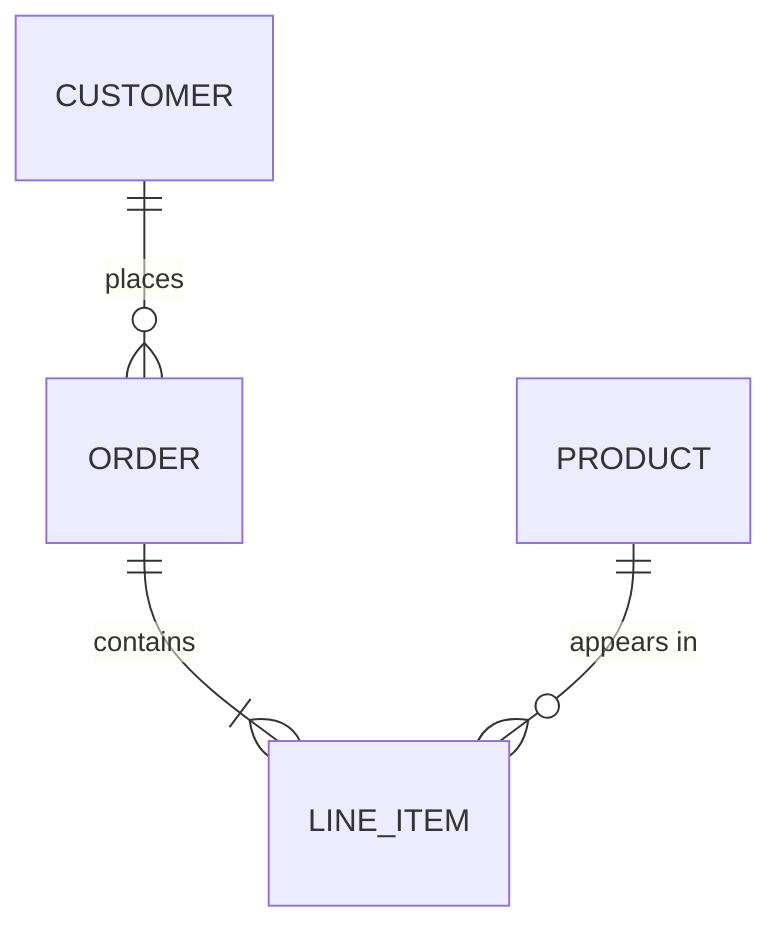
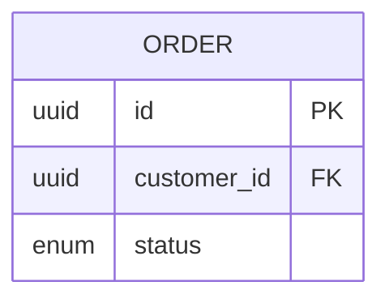
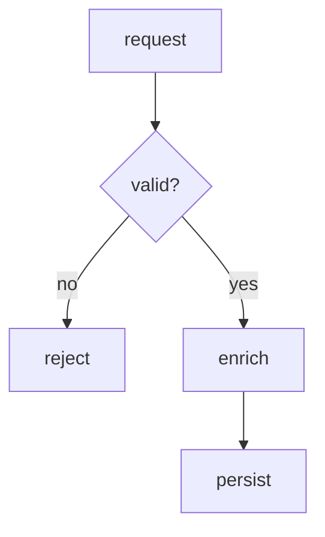
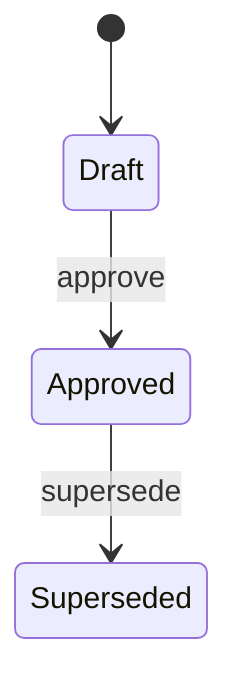

# Diagram format

Concrete templates for the two shapes `using-diagrams` anchors on, each in both mediums.
Copy the one that matches the shape and the destination; adapt the labels to the real
material. The medium is chosen by the fork in `SKILL.md` — mermaid where the destination
renders markdown, ASCII everywhere else.

Each mermaid template below is shown inside an outer fence so you can see its ` ```mermaid `
line. Copy **only the inner block** — three backticks, the word `mermaid`, and the diagram —
and keep that fence flush to the left margin.

## GitHub-compatible mermaid

Every mermaid diagram this skill writes must render on GitHub — the specs, ADRs, PRs, and
issues it lands in are all drawn by GitHub's renderer, which pins an older mermaid than a
local preview and sanitizes for safety. Stay inside what GitHub actually draws:

- **Fence at column 0, exactly three backticks and `mermaid`.** A fence indented four or
  more spaces becomes an *indented code block* — GitHub prints the source as text instead of
  drawing it — and four backticks in place of three does the same. This is the single most
  common reason a diagram that looked fine locally shows up as raw text on GitHub.
- **One diagram per block.**
- **Core diagram types only** — `flowchart`/`graph`, `sequenceDiagram`, `stateDiagram-v2`,
  `erDiagram`, `classDiagram`. Skip the newest experimental types; GitHub lags them.
- **Quote a label that carries a breaking character** — a parenthesis, colon, semicolon,
  `#`, angle bracket, quote, or a pipe inside an edge label: `A["place order (web)"]`,
  `X -->|"on failure"| Y`, `ORDER ||--o{ ITEM : "appears in"`. A bare `?` or `.` in node
  text needs no quoting, and quoting where it isn't needed is its own risk on GitHub's older
  mermaid — quote the breakers, not everything.
- **No `%%{init}%%` theme directives and no `click`/JS interactions** — GitHub strips them;
  the diagram either loses the styling or fails to parse.
- **When in doubt, preview it** — paste the block into a GitHub issue or PR preview before
  relying on it, rather than trusting a local renderer that runs a newer mermaid.

## ER diagram

An entity-relationship model: the entities and how they relate, with cardinality.

### mermaid (rendered-markdown destinations)

````

````

Cardinality is the pair of glyphs on each end: `||` exactly one, `o{` zero-or-many, `|{`
one-or-many, `o|` zero-or-one. Read each relationship as `LEFT <left-card>--<right-card>
RIGHT : label`. Add attributes inside a block only when they carry the point:

````

````

### ASCII (plain-text destinations)

```text
CUSTOMER ──< ORDER ──< LINE_ITEM >── PRODUCT
   1        n   1       n    n        1

──<  one-to-many (crow's foot on the "many" end)
>──  many-to-one
──   one-to-one
```

Keep the cardinality numbers on the line below the entities, under the end they annotate.
Within a docblock, hold to the 72-column budget in `clarifying-docblocks`'
`references/diagram-rules.md`.

## Process-flow diagram

The steps of an approach and where it branches.

### mermaid (rendered-markdown destinations)

````

````

`[square]` is a step, `{curly}` is a decision, `-->|label|` is a labelled edge. `TD` draws
top-down; `LR` draws left-to-right when the flow is wider than it is deep.

### ASCII (plain-text destinations)

```text
request --> validate --> enrich --> persist
               |            |
               v            v
            reject      cache miss --> upstream
```

Branches drop below the main line with `|` and `v`; the happy path runs straight across so
the eye follows it first.

## Other shapes

ER and process flow are the two anchors, not the boundary. When a sequence of messages or a
state machine is the shape that prose describes badly, draw it — mermaid `sequenceDiagram` or
`stateDiagram-v2` on a rendered-markdown destination, ASCII on a plain-text one.

````

````

The rule is unchanged: draw only a shape prose describes badly, ground every mark in real
material, and pick the medium by whether the destination renders mermaid.
