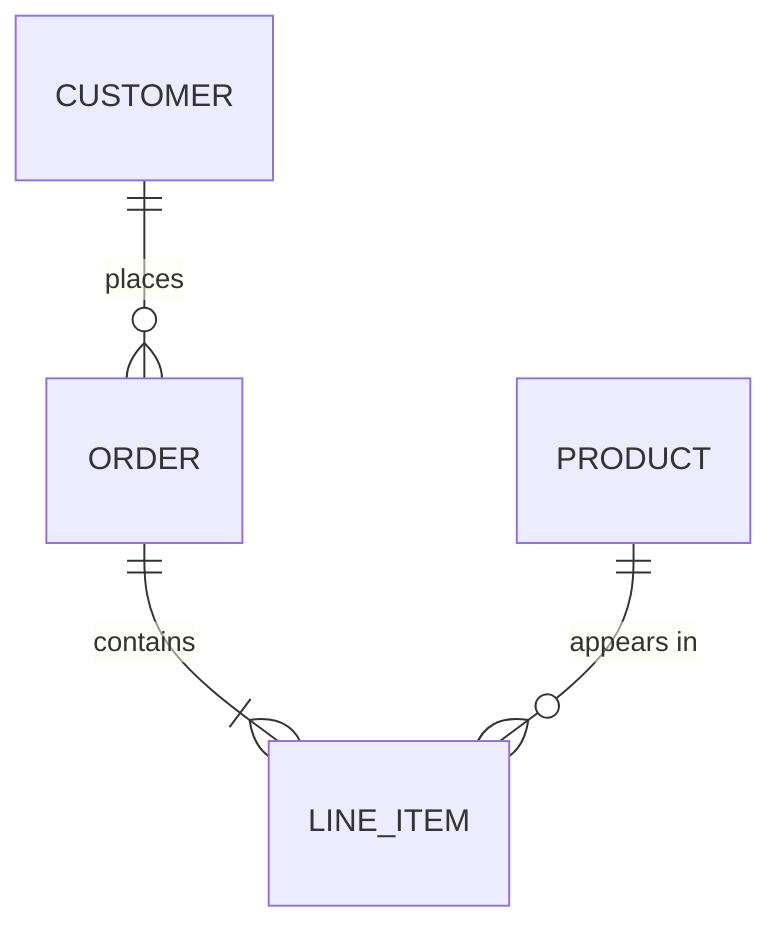
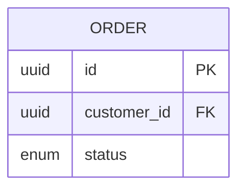
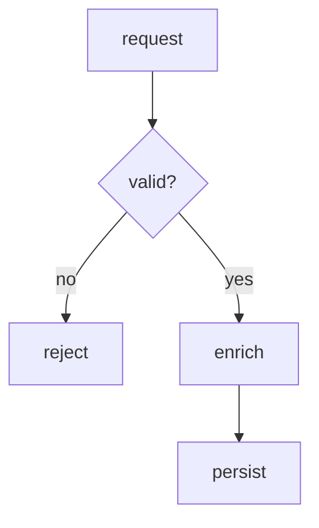
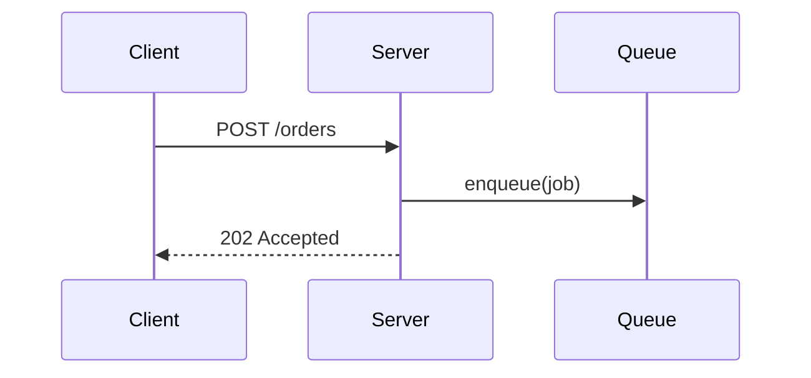
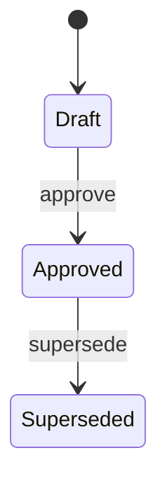

# Diagram format

Concrete templates for the two shapes `using-diagrams` anchors on, each in both mediums.
Copy the one that matches the shape and the destination; adapt the labels to the real
material. The medium follows the fork in `SKILL.md`.

Each mermaid template below is shown inside an outer fence so you can see its ` ```mermaid `
line. Copy **only the inner block** — three backticks, the word `mermaid`, and the diagram —
and keep that fence flush to the left margin.

## GitHub-compatible mermaid

Every mermaid diagram this skill writes must render on GitHub — the specs, PRs, and
issues it lands in are all drawn by GitHub's renderer, which pins an older mermaid than a
local preview and sanitizes for safety. Stay inside what GitHub actually draws:

- **Fence at column 0, exactly three backticks and `mermaid`.** Indent it four or more
  spaces, or use four backticks, and GitHub prints the source as text instead of drawing it.
- **One diagram per block.**
- **Core diagram types only** — `flowchart`/`graph`, `sequenceDiagram`, `stateDiagram-v2`,
  `erDiagram`, `classDiagram`. Skip the newest experimental types; GitHub lags them.
- **Quote a label that carries a breaking character** — a parenthesis, colon, semicolon,
  `#`, angle bracket, quote, or a pipe inside an edge label: `A["place order (web)"]`,
  `X -->|"on failure"| Y`, `ORDER ||--o{ ITEM : "appears in"`. A bare `?` or `.` in node
  text needs no quoting, and quoting where it isn't needed is its own risk on GitHub's older
  mermaid — quote the breakers, not everything.
- **No `%%{init}%%` theme directives and no `click`/JS interactions** — GitHub strips them;
  the diagram either loses the styling or fails to parse.
- **When in doubt, preview it** — paste the block into a GitHub issue or PR preview before
  relying on it, rather than trusting a local renderer that runs a newer mermaid.

## Diagram craft

These rules hold in both mediums; the alignment ones bite hardest in ASCII, where nothing is
drawn for you.

- **Label every edge with what actually moves across it** — a route (`POST /settings/teams`),
  a param type (`CreateTeamActionParams`), a field (`plan_id`) — not a generic verb like
  "sends" or "calls". The label is where a diagram earns its keep over a box-and-arrow sketch.
- **Use the real names** from the material as node labels — the actual file, class, route, or
  entity — so the diagram is clickable in the reader's head and greppable against the code.
- **Put a condition or gate on the edge label** (`no →`, `feature off →`, `draft →`), not in
  its own box. A gate is a branch on an edge, not a step of its own.
- **Shorten a name that would overflow, and give the full name in the prose beneath.** A box
  that runs past the width budget breaks the drawing; a footnote in prose costs nothing.

For ASCII specifically:

- **Light box-drawing characters and arrowheads only** (`┌ ┐ └ ┘ ├ ┤ ┬ ┴ ┼ ─ │`, `▶ ◀ ▼ ▲`).
  Avoid `/` and `\` diagonals — they drift out of alignment the moment a label changes length.
- **Align every border, lifeline, and arrowhead exactly.** Count the characters before
  committing to a layout: one column off reads as broken, and a reader who stops trusting the
  drawing stops trusting the prose beside it.
- **Stay under ~80 columns and ~15 boxes** — 72 columns inside a docblock, the budget in
  `references/diagram-rules.md`. If the shape needs more, split it into
  two diagrams at the natural seam and name the seam.

## ER diagram

An entity-relationship model: the entities and how they relate, with cardinality.

### mermaid (rendered-markdown destinations)

````

````

Cardinality is the pair of glyphs on each end: `||` exactly one, `o{` zero-or-many, `|{`
one-or-many, `o|` zero-or-one. Read each relationship as `LEFT <left-card>--<right-card>
RIGHT : label`. Add attributes inside a block only when they carry the point:

````

````

### ASCII (plain-text destinations)

```text
CUSTOMER ──< ORDER ──< LINE_ITEM >── PRODUCT
   1        n   1       n    n        1

──<  one-to-many (crow's foot on the "many" end)
>──  many-to-one
──   one-to-one
```

Keep the cardinality numbers on the line below the entities, under the end they annotate.

## Process-flow diagram

The steps of an approach and where it branches.

### mermaid (rendered-markdown destinations)

````

````

`[square]` is a step, `{curly}` is a decision, `-->|label|` is a labelled edge. `TD` draws
top-down; `LR` draws left-to-right when the flow is wider than it is deep.

### ASCII (plain-text destinations)

```text
request --> validate --> enrich --> persist
               |            |
               v            v
            reject      cache miss --> upstream
```

Branches drop below the main line with `|` and `v`; the happy path runs straight across so
the eye follows it first.

## Other shapes

ER and process flow are the two anchors, not the boundary. When a sequence of messages or a
state machine is the shape that prose describes badly, draw it — mermaid on a rendered-markdown
destination, ASCII on a plain-text one.

### Sequence — request paths, queue flows, anything crossing a process boundary

Participants across the top, one vertical lifeline each, messages as labelled horizontal
arrows; a return points back left.

#### mermaid (rendered-markdown destinations)

````

````

#### ASCII (plain-text destinations)

```text
 Client               Server                Queue
    │                    │                    │
    ├─ POST /orders ────▶│                    │
    │                    ├─ enqueue(job) ────▶│
    │◀── 202 Accepted ───┤                    │
```

### Lifecycle — statuses and the transitions between them

One box or bracket per status, the transition name in parentheses on the edge.

#### mermaid (rendered-markdown destinations)

````

````

#### ASCII (plain-text destinations)

```text
[draft] ──(approve)──▶ [approved] ──(supersede)──▶ [superseded]
```
