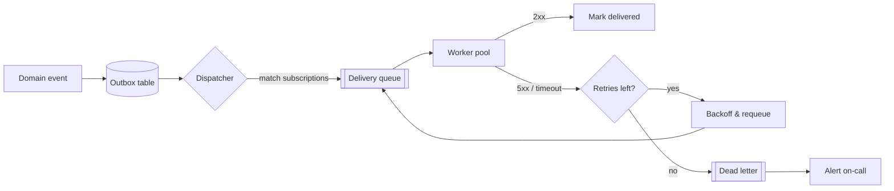
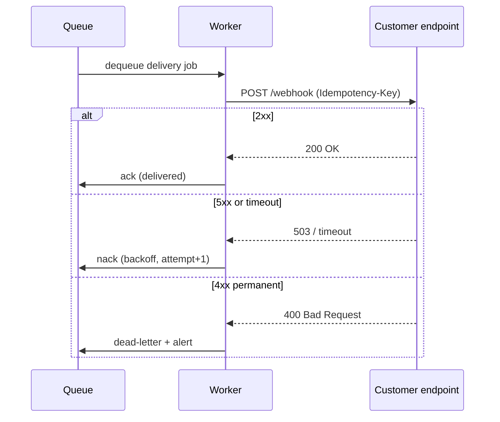

# Design Spec: Webhook Delivery Pipeline

Status: Approved · Owner: platform-team · Version: 2.1

This spec describes how outbound webhooks are queued, delivered, and retried. It replaces the
old inline-delivery model, where a slow customer endpoint could block the request that produced
the event. Delivery is now fully asynchronous with bounded retries and a dead-letter path.

## Goals

- Never block a producing request on webhook delivery.
- Deliver each event at least once, in order per subscription, with idempotency keys.
- Retry transient failures with exponential backoff, then dead-letter and alert.

## Delivery flow

When a domain event fires, the producer writes it to the outbox in the same transaction as the
business change, so an event is never lost if delivery infrastructure is down. A dispatcher polls
the outbox, resolves matching subscriptions, and enqueues one delivery job per subscription.

## Retry semantics

A worker attempts delivery, expecting a `2xx` within the 10-second timeout. Anything else — a `5xx`,
a timeout, a connection reset — is a transient failure and is retried. A `4xx` (other than `429`) is
treated as permanent: the endpoint rejected the payload, so retrying is pointless, and the job goes
straight to the dead-letter queue.

## Backoff schedule

Backoff is exponential with jitter, capped at six attempts over roughly one hour. After the sixth
failure the job is dead-lettered and on-call is paged with the subscription id and last response.

## Idempotency

Every delivery carries a stable `Idempotency-Key` derived from the event id, so a customer that
receives the same event twice (because our ack was lost) can safely de-duplicate. Keys are stable
across retries and never reused across distinct events.
