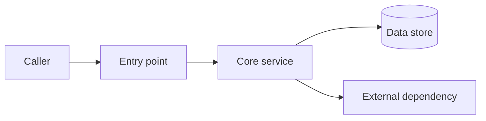
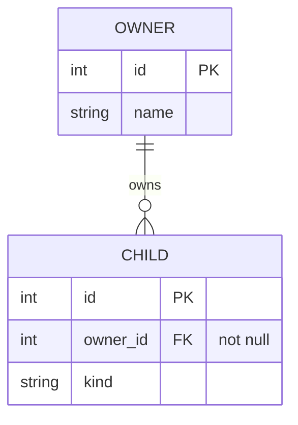
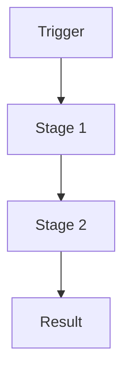

<!--
  Feature / Architecture Doc — MARKDOWN SKELETON (plain portable GFM)
  ------------------------------------------------------------------------------------------------
  The Markdown twin of references/templates/pdf/feature-doc.pdf.tsx. Same sections, no styling: this
  is plain GitHub-Flavored Markdown that renders anywhere (GitHub, a wiki, any viewer) with no build
  step. There is NO render and NO run directory — you copy this file, fill it, and you are done.

  TO USE:
    1. Copy this file to where the doc belongs (a repo path, a wiki page, or $RUNDIR beside a PDF).
    2. Map the feature from the SOURCE, not from memory — read the code:
         • Entry points (controllers, commands, endpoints), the core services, their dependencies.
         • The data model (entities, ownership, invariants) — enough for a real ER diagram.
         • The process flow from trigger to result — enough for a real pipeline diagram.
         • The wire contract (request/response, config payloads) and the class carrying each duty.
         • The edge cases / failure modes the code actually handles, and how it is tested.
    3. Replace every <…> placeholder and TODO. Delete any section the feature does not need — a
       shorter true doc beats a padded one. Keep the section HEADINGS that remain unchanged (they are
       the parity contract with the PDF template; test/templates/parity.test.ts checks them).
    4. Keep mermaid diagrams as ```mermaid fenced code-blocks — do NOT render them to images. GitHub
       renders mermaid fences natively; other viewers show the source, which is still readable.

  DISCIPLINE:
    • Describe what the code ACTUALLY does — read the target, don't invent behavior.
    • Every diagram is real (architecture flow, ER model, request pipeline), not decoration.
    • Code/payload samples are verbatim or faithfully representative; keep them small enough to read.
    • This is the reader's document — no "generated by" line, no tool/skill attribution.
  ------------------------------------------------------------------------------------------------
-->

# <Feature Name>

> <Team / area> · <system> · <YYYY-MM-DD>

<One or two sentences a newcomer can read: what this feature is and the problem it solves.>

| | |
|---|---|
| **Platform** | <runtime / framework> |
| **Module** | <bundle / package / dir> |
| **Author** | <name> |

## Plain-language overview

<A few plain-language paragraphs: what this feature is for, who uses it, and the problem it solves —
readable by someone who has never seen the code.>

## Architecture at a glance

<How the pieces fit: entry point → core service → data store / external dependency.>



## Data model

<The entities, their ownership, and the invariants. Omit this section if the feature has no data
model of its own.>



## Process flow

<The path from trigger to result, one stage at a time.>



## Interfaces & payloads

<The wire contract: request/response shapes, config payloads. Keep samples small and verbatim.>

**Outbound / definition**

```json
{
  "key": "value",
  "nested": { "field": "value" }
}
```

**Inbound / request**

```json
{
  "key": "value"
}
```

## Components & responsibilities

<Each class/module and the one responsibility it carries.>

| Component | Responsibility |
|---|---|
| `<ClassOrModule>` | <the single thing it is responsible for> |
| `<ClassOrModule>` | <…> |

## Edge cases & failure modes

<The edge cases and failure modes the code actually handles — and what it does in each.>

- **<edge case>** — <what the code does>.
- **<failure mode>** — <how it is handled / surfaced>.

## Limits & configuration

<Hard limits, tunables, and configuration knobs. Delete if none.>

- **<limit or setting>** — <value / meaning>.

## Testing

<How this feature is tested and how to run those tests.>

```bash
# TODO: how to run this feature's tests
<test command>
```
